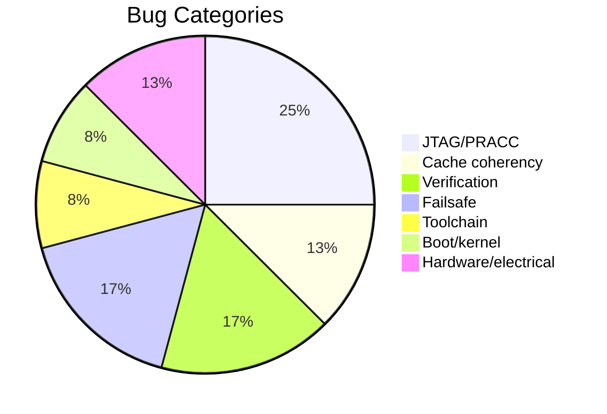

# Bug Index

All 23 bugs encountered during the MR18 OpenWrt JTAG flash project, from first power-on to successful failsafe boot.

## Summary Table

| Bug # | Title | Category | Related Doc | One-line Summary |
|-------|-------|----------|-------------|------------------|
| [1](bug-01-wrong-binary.md) | Wrong Binary (ar71xx vs ath79) | Toolchain | [address-map](../reference/address-map.md) | ar71xx lzma-loader zeroes BSS before relocation, wiping LZMA data. |
| [2](bug-02-openocd-timing.md) | OpenOCD Startup Timing | JTAG/PRACC | [script-reference](../reference/script-reference.md) | OpenOCD started before power-on; no live TAP during init scan. |
| [3](bug-03-socket-contamination.md) | Socket Buffer Contamination | JTAG/PRACC | [script-reference](../reference/script-reference.md) | Hardcoded 0.5s socket timeout caused _drain() to return before load_image finished. |
| [4](bug-04-pracc-bit-errors.md) | PRACC Write Bit Errors | JTAG/PRACC | [mips-memory-model](../technical/mips-memory-model.md) | PRACC handshake protocol errors caused 18 single-bit flips per 45 KB sample. |
| [5](bug-05-hardware-watchdog.md) | Hardware Watchdog | Boot/kernel | [address-map](../reference/address-map.md) | AR9344 hardware watchdog continues counting during JTAG halt. |
| [6](bug-06-named-pipe-eof.md) | Named Pipe EOF | Toolchain | [script-reference](../reference/script-reference.md) | Named pipe "w" mode sends EOF on close, killing scpi-repl. |
| [7](bug-07-flush-trampoline.md) | Flush Trampoline Timeout | Cache coherency | [mips-memory-model](../technical/mips-memory-model.md) | CACHE instruction exception when running from KSEG1 with Nandloader exception vectors. |
| [8](bug-08-phantom-verify-errors.md) | Phantom Verify Errors | Verification | [mips-memory-model](../technical/mips-memory-model.md) | PRACC reads inherit the same bit-flip rate as writes, producing phantom corrections. |
| [9](bug-09-trampoline-overlap.md) | Trampoline Overlaps Binary | Verification | [address-map](../reference/address-map.md) | TRAMPOLINE_ADDR inside loaded binary range overwrote XOR program during chunk rewrite. |
| [10](bug-10-xor-cancellation.md) | XOR Cancellation | Verification | [mips-memory-model](../technical/mips-memory-model.md) | Two corrupt words with matching XOR deltas cancelled, passing full-binary checksum. |
| [11](bug-11-dcache-stale-data.md) | D-Cache Stale Data | Cache coherency | [mips-memory-model](../technical/mips-memory-model.md) | D-cache held stale Cisco data; KSEG1 verification saw correct RAM, KSEG0 execution got stale bytes. |
| [12](bug-12-beq-vs-bne.md) | BEQ vs BNE Encoding | Verification | [mips-memory-model](../technical/mips-memory-model.md) | 1-bit opcode error (op=4 vs op=5) caused flush loop to run once instead of 4096 times. |
| [13](bug-13-flush-ordering.md) | Flush Ordering | Cache coherency | [mips-memory-model](../technical/mips-memory-model.md) | Post-load flush evicted dirty Cisco D-cache lines back to DRAM, overwriting OpenWrt binary. |
| [14](bug-14-ethernet-silent.md) | Ethernet Silent | Boot/kernel | [script-reference](../reference/script-reference.md) | Meraki NAND overlay mounted over initramfs, running Cisco userspace instead of OpenWrt. |
| [15](bug-15-meraki-nand-overlay.md) | Meraki NAND Overlay | Failsafe | [script-reference](../reference/script-reference.md) | OpenWrt preinit mounted Meraki NAND overlay; Meraki management frames appeared instead of OpenWrt. |
| [16](bug-16-failsafe-timing.md) | Failsafe Timing | Failsafe | [script-reference](../reference/script-reference.md) | GPIO17 asserted at t=30s, but failsafe window closed at t=18s. |
| [17](bug-17-hammer-freezes-cpu.md) | Missing Resume | JTAG/PRACC | [address-map](../reference/address-map.md) | mdw halts CPU for PRACC read; CPU stayed halted through entire GPIO hammer loop. |
| [18](bug-18-mdw-mww-silent-fail.md) | mdw/mww Require Halt | JTAG/PRACC | [address-map](../reference/address-map.md) | After resume, mdw returns ERROR_TARGET_NOT_HALTED silently; GPIO reads returned nothing useful. |
| [19](bug-19-gpio-vs-pullup.md) | GPIO vs Pull-up | Hardware/electrical | [address-map](../reference/address-map.md) | External pull-ups (5 kohm effective) overpower AR934x GPIO drive strength. |
| [20](bug-20-reset-supervisor.md) | Reset Supervisor IC | Hardware/electrical | [prerequisites](../guides/prerequisites.md) | Dedicated reset supervisor IC drives GPIO17 HIGH with strong CMOS output (10-50 mA). |
| [21](bug-21-manual-prompt-window.md) | Manual Prompt Too Late | Failsafe | [script-reference](../reference/script-reference.md) | Useless JTAG hammer consumed 25s before printing prompt; failsafe window already closed. |
| [22](bug-22-resistor-wrong-side.md) | Resistor Wrong Side | Hardware/electrical | [prerequisites](../guides/prerequisites.md) | 100 ohm between GPIO17 net and EN transistor caused voltage drop on wrong side. |
| [23](bug-23-en-before-boot.md) | EN Before Boot | Failsafe | [script-reference](../reference/script-reference.md) | EN assertion at t=12s released before kernel finished LZMA decompression at t=18-25s. |

## Bug Category Distribution

### Category Breakdown

- **JTAG/PRACC (6)**: Bugs 2, 3, 4, 17, 18—protocol-level issues with EJTAG PRACC memory access and OpenOCD communication.
- **Verification (4)**: Bugs 8, 9, 10, 12—errors in the verify-and-correct pipeline (phantom reads, trampoline placement, XOR cancellation, instruction encoding).
- **Failsafe (4)**: Bugs 15, 16, 21, 23—timing and trigger issues getting OpenWrt into failsafe mode.
- **Cache coherency (3)**: Bugs 7, 11, 13—MIPS D-cache stale data and flush ordering relative to JTAG load.
- **Hardware/electrical (3)**: Bugs 19, 20, 22—physical signal contention between GPIO, pull-ups, reset supervisor IC, and EN wiring.
- **Toolchain (2)**: Bugs 1, 6—wrong firmware target and named pipe file mode.
- **Boot/kernel (2)**: Bugs 5, 14—hardware watchdog and NAND overlay issues during kernel boot.
