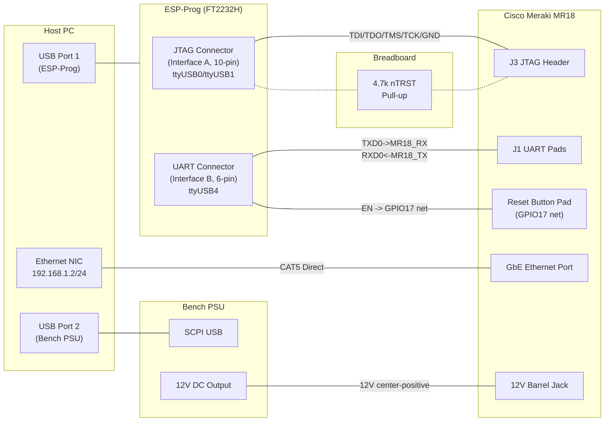
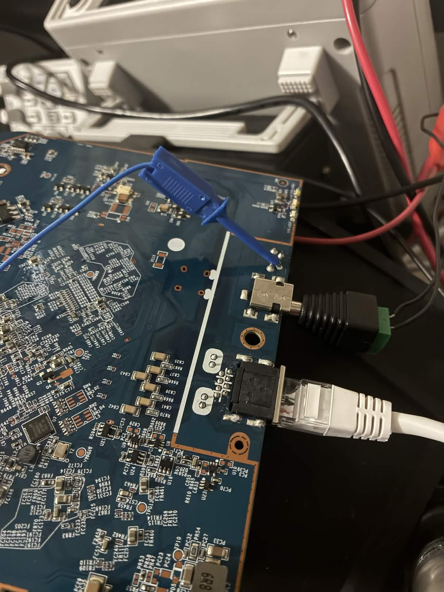
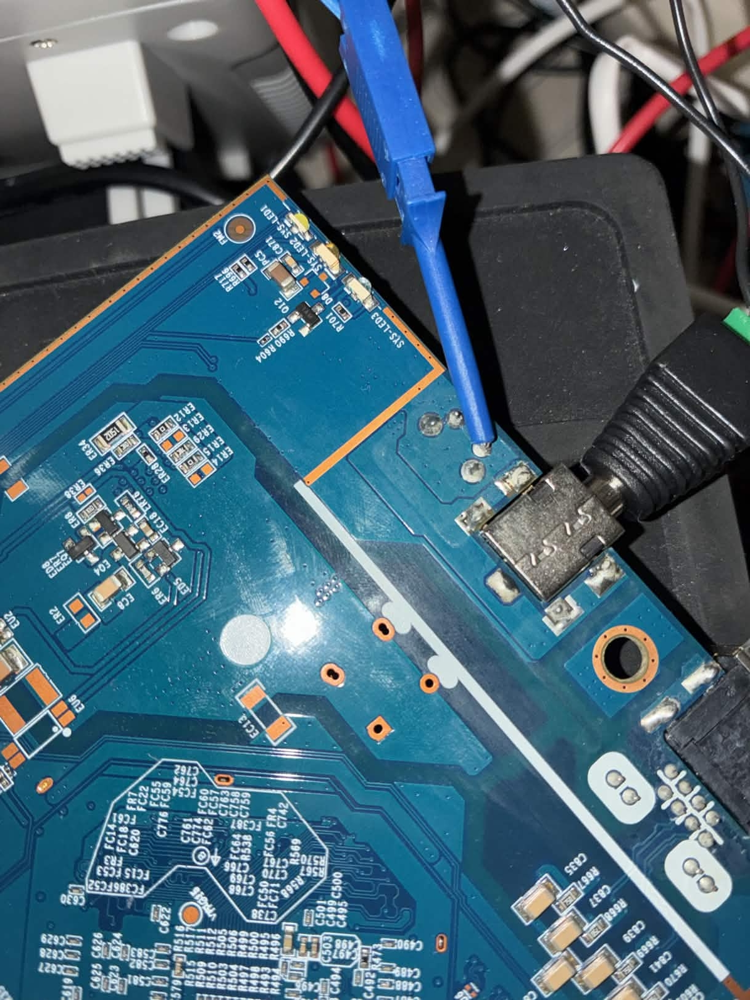
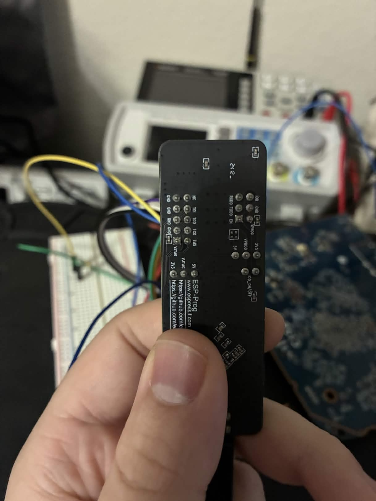
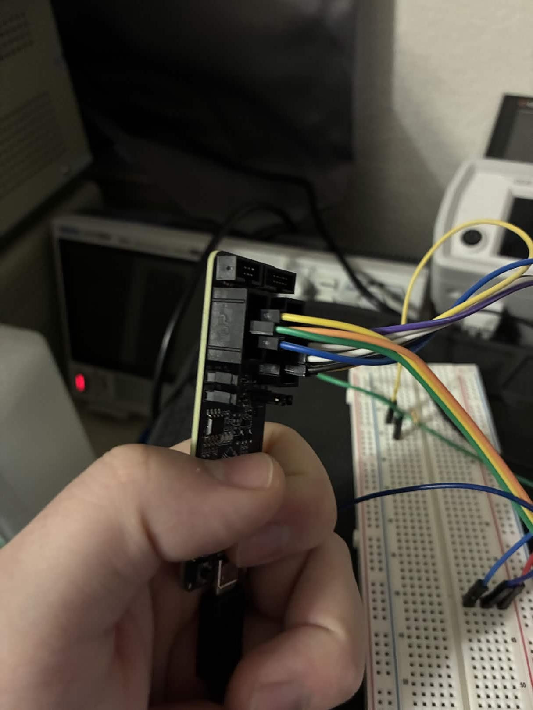
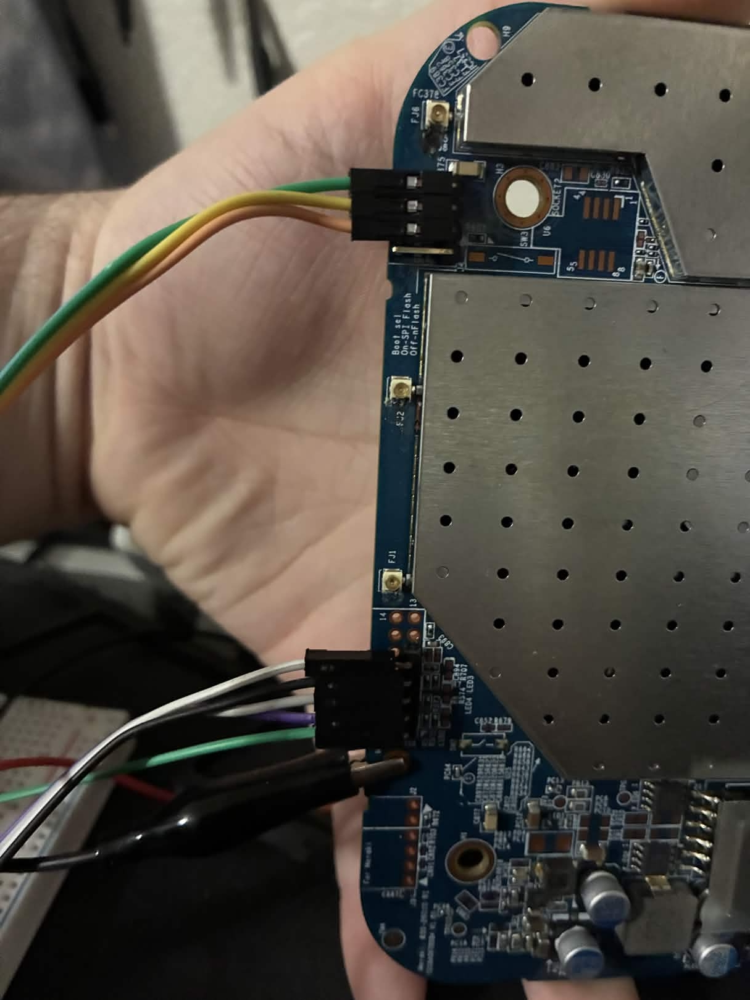
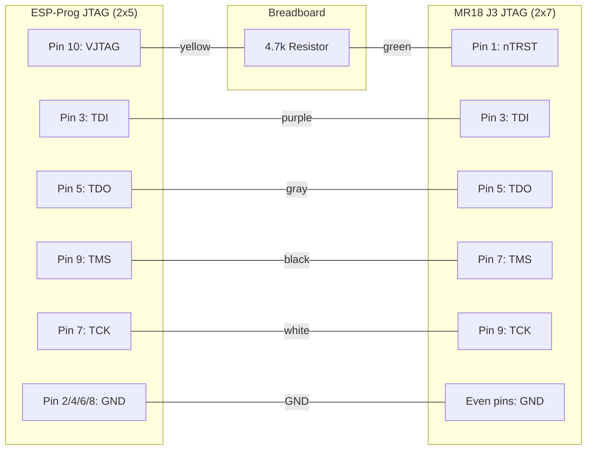
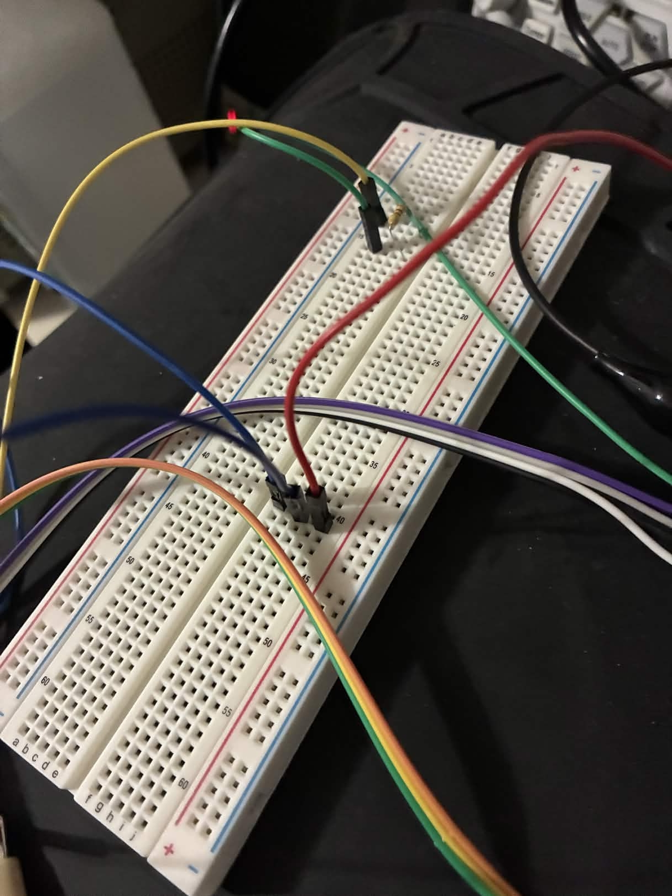
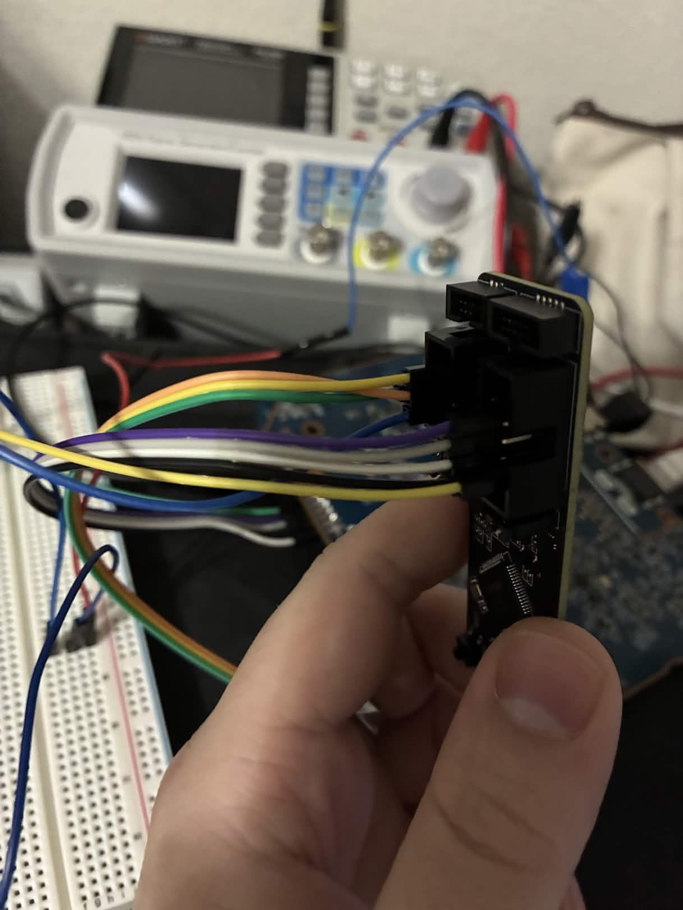

# Hardware Setup

Physical connections between the host PC, ESP-Prog JTAG adapter, bench power supply, and the Cisco Meraki MR18 access point. Complete this guide before running any scripts.

## Bench Layout



## MR18 Teardown



The MR18 case is held together by clips around the perimeter. Pry the front cover off starting from the Ethernet port side. Inside you will find:

1. **J3—JTAG header**: An unpopulated 14-pin (2x7) through-hole pad array near the center of the PCB at 2.54 mm pitch. This is the primary JTAG connection.

2. **J1—UART pads**: A 4-pin pad array near the board edge, carrying the QCA9557's serial console (115200 baud, 8N1, 3.3V TTL).

3. **Reset button pad**: A tactile switch pad with two connections—one pad connects to GND and the other to the GPIO17 net. The non-GND pad is where the EN wire connects. To identify which pad is GND, use a continuity tester against the ground plane or any known GND point (such as the barrel jack outer ring or a JTAG GND pin).

4. **Barrel jack**: 12V center-positive DC input, located next to the Ethernet port.



## ESP-Prog Connector Pinouts

The ESP-Prog has two connectors: a 10-pin JTAG header (Interface A) and a 6-pin UART header (Interface B).





### JTAG Connector (10-pin, 2x5, 2.54mm)

```
             ESP-Prog JTAG
        +-----+-----+-----+-----+-----+
  Pin:  |  1  |  3  |  5  |  7  |  9  |
Signal: | NC  | TDI | TDO | TCK | TMS |
        +-----+-----+-----+-----+-----+
  Pin:  |  2  |  4  |  6  |  8  | 10  |
Signal: | GND | GND | GND | GND |VJTAG|
        +-----+-----+-----+-----+-----+
```

| Pin | Signal | Notes |
|-----|--------|-------|
| 1 | NC | Not connected |
| 2 | GND | Ground |
| 3 | TDI | Test Data In |
| 4 | GND | Ground |
| 5 | TDO | Test Data Out |
| 6 | GND | Ground |
| 7 | TCK | Test Clock |
| 8 | GND | Ground |
| 9 | TMS | Test Mode Select |
| 10 | VJTAG | 3.3V reference output |

### UART Connector (6-pin, 2x3, 2.54mm)

```
  ESP-Prog UART
  +-----+-------+------+
  |  1  |   2   |  3   |
  | IO0 | RXD0  | GND  |
  +-----+-------+------+
  |  4  |   5   |  6   |
  | TXD0| VPROG |  EN  |
  +-----+-------+------+
```

| Pin | Signal | Notes |
|-----|--------|-------|
| 1 | IO0 | GPIO0 control (not used for MR18) |
| 2 | RXD0 | UART receive—connect to MR18 TXD |
| 3 | GND | Ground |
| 4 | TXD0 | UART transmit—connect to MR18 RXD |
| 5 | VPROG | Programming voltage (not used for MR18) |
| 6 | EN | Enable—NPN open-collector pull-down, driven by RTS |

## MR18 J3 JTAG Header (14-pin, 2x7, 2.54mm)



The J3 pinout was determined empirically from the working wire connections (confirmed by signal matching with the ESP-Prog). Pins 1-9 (odd) follow a standard MIPS EJTAG layout. Pins 11-14 are standard EJTAG assignments but were not used or verified.

```
              MR18 J3 JTAG Header
         (pin 1 marked on PCB silkscreen)

        +-------+------+------+------+------+-------+------+
  Pin:  |  1    |  3   |  5   |  7   |  9   | 11    | 13   |
Signal: |nTRST  | TDI  | TDO  | TMS  | TCK  |nSRST? | VREF?|
        +-------+------+------+------+------+-------+------+
  Pin:  |  2    |  4   |  6   |  8   | 10   | 12    | 14   |
Signal: | GND   | GND  | GND  | GND  | GND  | GND   | GND  |
        +-------+------+------+------+------+-------+------+
```

| Pin | Signal | Verified | Description |
|-----|--------|----------|-------------|
| 1 | nTRST | Yes (wire color match) | JTAG TAP reset, active-low. Pull HIGH to keep TAP active |
| 2 | GND | -- | Ground |
| 3 | TDI | Yes (wire color match) | Test Data In |
| 4 | GND | -- | Ground |
| 5 | TDO | Yes (wire color match) | Test Data Out |
| 6 | GND | -- | Ground |
| 7 | TMS | Yes (wire color match) | Test Mode Select |
| 8 | GND | -- | Ground |
| 9 | TCK | Yes (wire color match) | Test Clock |
| 10 | GND | -- | Ground |
| 11 | nSRST? | No | Likely system reset (connected to reset supervisor IC) |
| 12 | GND | -- | Ground |
| 13 | VREF? | No | Likely 3.3V target voltage reference |
| 14 | GND | -- | Ground |

Only pins 1, 3, 5, 7, 9 and a GND pin were wired. Pins 11-14 were not connected and their assignments are inferred from standard 14-pin EJTAG convention.

## MR18 J1 UART Pads

Four pads in a vertical row (top to bottom when the board is oriented with the Ethernet port at the bottom):

```
  MR18 J1 UART
  +-----+
  | GND |  (top)
  +-----+
  | TXD |  MR18 transmit -> ESP-Prog RXD0
  +-----+
  | RXD |  MR18 receive <- ESP-Prog TXD0
  +-----+
  | NC  |  (bottom, not connected—possibly VCC)
  +-----+
```

## Wiring

### JTAG wiring: ESP-Prog 2x5 to MR18 J3 2x7



| Wire Color | ESP-Prog Pin | ESP-Prog Signal | MR18 J3 Pin | MR18 Signal |
|------------|-------------|-----------------|-------------|-------------|
| purple | 3 | TDI | 3 | TDI |
| gray | 5 | TDO | 5 | TDO |
| black | 9 | TMS | 7 | TMS |
| white | 7 | TCK | 9 | TCK |
| yellow + green | 10 (VJTAG) | 3.3V through 4.7k | 1 | nTRST pull-up |
| (any) | 2/4/6/8 | GND | any even pin | GND |

Note: ESP-Prog and MR18 pin numbers do NOT match for TMS and TCK—connect by **signal name**, not by pin number.

Both operate at 3.3V logic. No level shifter needed. Do NOT connect ESP-Prog VJTAG directly to any MR18 pin—it only feeds the 4.7k pull-up resistor.

**4.7k pull-up purpose:** nTRST is active-low. Pulling it HIGH through 4.7k keeps the JTAG TAP controller out of reset and available for probing. Without this pull-up, nTRST may float LOW, holding the TAP in reset and preventing OpenOCD from scanning the chain.





### UART + EN wiring: ESP-Prog 2x3 to MR18 J1 1x4 + reset button

```mermaid
graph LR
    subgraph ESP["ESP-Prog UART (2x3)"]
        EU2["Pin 2: RXD0"]
        EU3["Pin 3: GND"]
        EU4["Pin 4: TXD0"]
        EU6["Pin 6: EN"]
    end

    subgraph MR["MR18"]
        subgraph J1["J1 UART (1x4)"]
            MG["GND"]
            MT["TXD"]
            MR2["RXD"]
        end
        RST["Reset Button<br>non-GND pad<br>(GPIO17 net)"]
    end

    EU4 -- "TXD0 -> RXD" --- MR2
    EU2 -- "RXD0 <- TXD" --- MT
    EU3 -- "GND" --- MG
    EU6 -- "EN (direct, no resistor)" --- RST
```



| ESP-Prog UART Pin | Signal | Connects To |
|-------------------|--------|-------------|
| 2 (RXD0) | MR18 -> Host | MR18 J1 TXD pad |
| 3 (GND) | Ground | MR18 J1 GND pad |
| 4 (TXD0) | Host -> MR18 | MR18 J1 RXD pad |
| 6 (EN) | Failsafe trigger | MR18 reset button non-GND pad (GPIO17) |

ESP-Prog UART pins 1 (IO0) and 5 (VPROG) are not connected.

The EN pin is wired **directly** to the reset button pad—no series resistor. See [Bug 22](../bugs/bug-22-resistor-wrong-side.md) for why.

## EN Pin Wiring (Failsafe Trigger)

The ESP-Prog UART connector exposes an EN (enable) pin. This pin is driven by the FT2232H's RTS line through an NPN transistor—the same auto-reset circuit used by esptool.py for ESP32 boards.

### How it works

```
ser.rts = True   --> NPN base driven HIGH --> transistor conducts
                 --> EN pin (collector) pulled to GND
                 --> GPIO17 net pulled LOW (= reset button pressed)

ser.rts = False  --> NPN base driven LOW --> transistor off
                 --> EN pin released
                 --> reset supervisor pull-up returns GPIO17 HIGH (= button released)
```

### Wiring

Connect the ESP-Prog UART connector EN pin directly to the **non-GND pad of the MR18 reset button** (the GPIO17 net).

**Do NOT add a series resistor.** A 100 ohm resistor between the NPN collector and the GPIO17 net was the root cause of [Bug 22](../bugs/bug-22-resistor-wrong-side.md) -- the resistor was on the wrong side of the signal path. The voltage drop occurred between the NPN and GPIO17, leaving GPIO17 at 3.3V (reset supervisor still winning). Without the resistor, the NPN collector connects directly to the GPIO17 net and can sink enough current to pull the line LOW.

The ESP-Prog's NPN transistor circuit already has a base resistor that limits saturation current. No additional protection is needed.

### Purpose

The EN pin provides a software-controlled "button press" to trigger OpenWrt failsafe mode during the preinit boot phase. This is the belt-and-suspenders backup to the primary UART `f` key trigger (see [Failsafe Trigger](../technical/failsafe-trigger.md)).

## UART Wiring (Optional but Recommended)

The ESP-Prog UART connector (Interface B, ttyUSB4) also carries TX and RX lines for the MR18 serial console. These share the same physical connector as the EN pin.

| Signal | Direction | Description |
|--------|-----------|-------------|
| TXD0 | Host -> MR18 | ESP-Prog TX out to MR18 RX in |
| RXD0 | MR18 -> Host | MR18 TX out to ESP-Prog RX in |
| EN | Host -> MR18 | Failsafe trigger (see above) |
| GND | Common | Shared ground (must be connected) |

Connect TXD0 to MR18's UART RX pad on J1, and RXD0 to MR18's UART TX pad on J1.

### Serial parameters

- Baud rate: 115200
- Data bits: 8
- Parity: None
- Stop bits: 1
- Logic level: 3.3V TTL

The UART connection serves three purposes:

1. **Failsafe trigger:** The `mr18_flash.py` script watches the UART console for the OpenWrt preinit prompt (`Press the [f] key and hit [enter] to enter failsafe mode`) and sends `f\n` to trigger failsafe. This is the primary and most reliable failsafe trigger.

2. **Post-failsafe setup:** After failsafe mode is detected, the script sends commands over UART to start the watchdog kicker, configure `eth0`, and start `telnetd`.

3. **Diagnostics:** All kernel boot messages, lzma-loader output, and preinit progress are visible on the UART console.

## Bench Power Supply

| Parameter | Value |
|-----------|-------|
| Voltage | 12V DC |
| Current limit | 1.5A |
| Connector | Center-positive barrel jack |
| Control | SCPI over USB serial (optional) |

A SCPI-capable bench PSU allows the `mr18_flash.py` script to automate power cycling during the JTAG timing attack. The script uses [scpi-repl](https://github.com/T-O-M-Tool-Oauto-Mationator/scpi-instrument-toolkit) to send SCPI commands via a named pipe.

If you do not have a SCPI PSU, you can use any 12V/1.5A supply and toggle power manually when the script prompts. Set `PSU_PIPE` to `/dev/null` in `mr18_flash.py`.

### SCPI connection

Connect the PSU's USB control port to the host PC. The `scpi-repl` utility discovers the instrument automatically. Commands are injected through a named pipe at `/tmp/scpi_pipe`.

## Device Enumeration

After plugging the ESP-Prog into the host USB port, verify the devices appear:

```sh
ls /dev/ttyUSB*
```

Expected output (device numbers may vary if other USB serial devices are connected):

| Device | FT2232H Channel | Purpose |
|--------|----------------|---------|
| `/dev/ttyUSB0` | Interface A | JTAG (used by OpenOCD) |
| `/dev/ttyUSB1` | Interface A | JTAG (secondary, unused) |
| `/dev/ttyUSB4` | Interface B | UART console + EN pin |

The gap between ttyUSB1 and ttyUSB4 occurs when other USB serial devices (such as the bench PSU) occupy ttyUSB2 and ttyUSB3. If your numbering differs, update the `ESPPROG_UART` constant in `mr18_flash.py` and the `UART` constant in `send_binary.py` and `uart_transfer.py`.

If no ttyUSB devices appear, check:

- ESP-Prog USB cable (must be a data cable, not charge-only)
- `lsusb` should show `0403:6010 Future Technology Devices International, Ltd FT2232C/D/H`
- The `ftdi_sio` kernel module must be loaded (`sudo modprobe ftdi_sio`)

## Host Ethernet

Connect a CAT5 Ethernet cable directly from the host PC's NIC to the MR18 GbE Ethernet port. No switch or router is needed.

Configure the host NIC with a static IP on the same subnet as the MR18's failsafe address:

```sh
sudo ip addr flush dev <your-nic>
sudo ip addr add 192.168.1.2/24 dev <your-nic>
sudo ip link set <your-nic> up
```

Replace `<your-nic>` with your Ethernet adapter's interface name (find it with `ip link`). The `mr18_flash.py` script does this automatically using the `HOST_NIC` and `HOST_IP` constants.

The MR18 in OpenWrt failsafe mode comes up at `192.168.1.1` with a static IP. The host must be at `192.168.1.2/24` (or any other address on the `192.168.1.0/24` subnet) to communicate.

## Wiring Checklist

Before proceeding to the [Quick Start Guide](quickstart.md), verify:

- [ ] J3 JTAG header (14-pin 2x7) soldered and tested for continuity
- [ ] ESP-Prog JTAG wired to J3 by signal name (TDI, TDO, TMS, TCK, GND)
- [ ] 4.7 kohm pull-up from ESP-Prog VJTAG (pin 10) to MR18 J3 pin 1 (nTRST)
- [ ] ESP-Prog UART EN pin wired to MR18 reset button non-GND pad (GPIO17 net) -- no series resistor
- [ ] ESP-Prog UART TX/RX wired to MR18 J1 UART pads (TXD0 to MR18_RX, RXD0 to MR18_TX)
- [ ] Bench PSU: 12V center-positive barrel jack to MR18, 1.5A current limit set
- [ ] Ethernet: direct CAT5 cable from host NIC to MR18 GbE port
- [ ] Host NIC configured: `192.168.1.2/24`
- [ ] `ls /dev/ttyUSB*` shows expected devices (ttyUSB0, ttyUSB1, ttyUSB4)

## Cross-references

- [Prerequisites](prerequisites.md) -- software dependencies, firmware downloads, cross-compiler setup
- [Quick Start Guide](quickstart.md) -- step-by-step from "hardware wired" to "OpenWrt running from NAND"
- [Failsafe Trigger](../technical/failsafe-trigger.md) -- how EN pin and UART `f` key work together
- [Bug 20: Reset Supervisor](../bugs/bug-20-reset-supervisor.md) -- why nSRST cannot be used for power cycling
- [Bug 22: Resistor Wrong Side](../bugs/bug-22-resistor-wrong-side.md) -- why the EN wire has no series resistor
