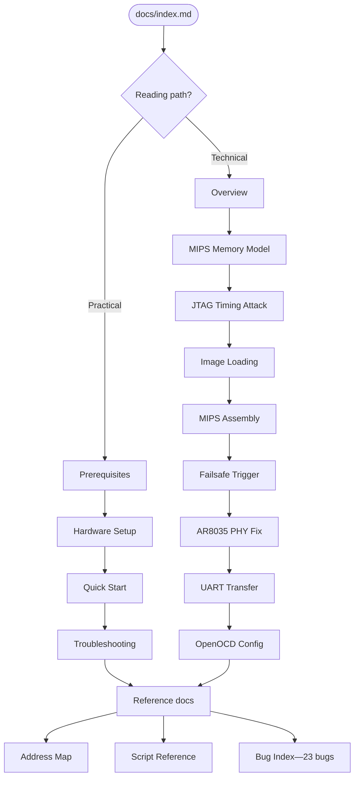

# MR18 OpenWrt Documentation

This project installs OpenWrt on a Cisco Meraki MR18 access point by exploiting a 2-second JTAG window during boot to halt the CPU, load a kernel into RAM, and flash NAND—bypassing Cisco's cloud lock entirely. JTAG is necessary because the MR18 has no serial bootloader console, no network recovery mode, and no way to interrupt the boot process without physical debug access. The project is complete: OpenWrt 25.12.0 runs from NAND with full bidirectional Ethernet, including a persistent fix for the AR8035 PHY RX clock bug.

---

## Reading Paths

### Practical Path—I want to reproduce this

| Step | Document | What you get |
|------|----------|--------------|
| 1 | [Prerequisites](guides/prerequisites.md) | Bill of materials, software, firmware images |
| 2 | [Hardware Setup](guides/hardware-setup.md) | JTAG wiring, soldering, UART pinout |
| 3 | [Quick Start](guides/quickstart.md) | Step-by-step flash procedure |
| 4 | [Troubleshooting](guides/troubleshooting.md) | Common failures and fixes |

### Technical Path—I want to understand how it works

| Step | Document | What you learn |
|------|----------|----------------|
| 1 | [Overview](overview.md) | Why the MR18 needs JTAG, project scope, boot sequence |
| 2 | [MIPS Memory Model](technical/mips-memory-model.md) | KSEG0/KSEG1 segments, D-cache coherency, cached vs uncached access |
| 3 | [JTAG Timing Attack](technical/jtag-timing-attack.md) | The 2-second boot window before Linux disables JTAG |
| 4 | [Image Loading](technical/image-loading.md) | Load-verify-fix-launch pipeline over PRACC at ~97 KB/s |
| 5 | [MIPS Assembly](technical/mips-assembly.md) | Hand-encoded 32-bit trampolines, bit-level instruction derivation |
| 6 | [Failsafe Trigger](technical/failsafe-trigger.md) | Five failed approaches and the working solution |
| 7 | [AR8035 PHY Fix](technical/ar8035-phy-fix.md) | RGMII RX clock delay via bare-metal MDIO register write |
| 8 | [UART Transfer](technical/uart-transfer.md) | Hex-over-serial protocol decoded by busybox awk |
| 9 | [OpenOCD Config](technical/openocd-config.md) | Adapter/target configuration and telnet command interface |

### Reference

| Document | Contents |
|----------|----------|
| [Address Map](reference/address-map.md) | Every address constant with hardware-spec derivation |
| [Script Reference](reference/script-reference.md) | CLI usage and configuration for all scripts |
| [Bug Index](bugs/index.md) | All 23 bugs catalogued from first power-on to successful boot |

---

## Reading Path Diagram

---

## Quick Links

| Document | Description |
|----------|-------------|
| [Overview](overview.md) | Project context: why the MR18 needs JTAG and what the project delivers |
| [Prerequisites](guides/prerequisites.md) | Hardware bill of materials, host software, and firmware image downloads |
| [Hardware Setup](guides/hardware-setup.md) | JTAG header soldering, ESP-Prog wiring diagram, UART pinout |
| [Quick Start](guides/quickstart.md) | End-to-end flash procedure from power-off to working OpenWrt |
| [Troubleshooting](guides/troubleshooting.md) | Diagnosis steps for JTAG failures, stalled boots, and network issues |
| [MIPS Memory Model](technical/mips-memory-model.md) | KSEG0/KSEG1 virtual segments, AR9344 D-cache, cached vs uncached coherency |
| [JTAG Timing Attack](technical/jtag-timing-attack.md) | Exploiting the 2-second window before Linux disables EJTAG |
| [Image Loading](technical/image-loading.md) | 6.9 MB kernel transfer over PRACC with verify-and-repair loop |
| [MIPS Assembly](technical/mips-assembly.md) | Bit-level derivation of every hand-encoded trampoline instruction |
| [Failsafe Trigger](technical/failsafe-trigger.md) | Entering OpenWrt failsafe mode after initramfs boot |
| [AR8035 PHY Fix](technical/ar8035-phy-fix.md) | Fixing RX silence by writing the RGMII clock delay register over MDIO |
| [UART Transfer](technical/uart-transfer.md) | Hex-encoded serial file transfer protocol for sysupgrade images |
| [OpenOCD Config](technical/openocd-config.md) | ESP-Prog adapter config, AR9344 target config, telnet interface |
| [Address Map](reference/address-map.md) | Every memory address and register constant used in the project |
| [Script Reference](reference/script-reference.md) | CLI usage, options, and default values for all Python scripts |
| [Bug Index](bugs/index.md) | All 23 bugs: wrong binaries, PRACC bit-flips, cache incoherence, and more |
