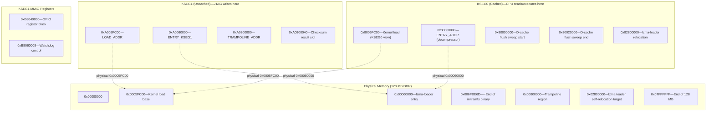

# Address Map

Every address constant used in the project, with derivation from hardware specs and OpenWrt conventions.

## MIPS Address Space Primer

The AR9344 / QCA9557 is a MIPS 74Kc core. MIPS32 divides the 4 GB virtual address space into fixed segments. No TLB mapping is needed for the two KSEG regions—they are hardwired translations to physical memory:

| Segment | Virtual Range | Physical Mapping | Cached | Used For |
|---------|--------------|-----------------|--------|----------|
| KUSEG   | `0x00000000`--`0x7FFFFFFF` | TLB-mapped | Configurable | User-mode (not used in bare-metal) |
| KSEG0   | `0x80000000`--`0x9FFFFFFF` | Subtract `0x80000000` | Yes (write-back) | Kernel code/data, lzma-loader self-relocation |
| KSEG1   | `0xA0000000`--`0xBFFFFFFF` | Subtract `0xA0000000` | No (uncached) | MMIO registers, JTAG load target |
| KSEG2   | `0xC0000000`--`0xFFFFFFFF` | TLB-mapped | Configurable | Kernel (not used here) |

### Translation Formulas

```
Physical = KSEG0_virtual - 0x80000000
Physical = KSEG1_virtual - 0xA0000000
KSEG0    = Physical + 0x80000000
KSEG1    = Physical + 0xA0000000
```

A given physical address is accessible through both KSEG0 (cached) and KSEG1 (uncached) simultaneously. JTAG writes go through KSEG1 to bypass the D-cache and write directly to physical RAM.

## Memory Layout Diagram



## Kernel Load and Entry Addresses

These come from the [OpenWrt MR18 JTAG wiki](https://openwrt.org/toh/meraki/mr18) and are embedded in the initramfs binary's lzma-loader header.

### 0xA005FC00 / 0x8005FC00—Kernel Load Address

```
LOAD_ADDR   = "0xa005FC00"   # KSEG1 (uncached)
LOAD_KSEG1  = "0xa005FC00"   # same, explicit name
```

- **Physical:** `0x0005FC00`
- **KSEG1:** `0xA005FC00` -- used by `load_image` (JTAG writes bypass D-cache)
- **KSEG0:** `0x8005FC00` -- the lzma-loader reads compressed data from here

The initramfs kernel binary is loaded starting at this address. The `0x5FC00` offset (383 KB into RAM) is an OpenWrt convention for ath79 targets, leaving room for the bootloader's data structures below.

### 0xA0060000 / 0x80060000—lzma-loader Entry Point

```
ENTRY_ADDR   = "0x80060000"   # KSEG0 (cached execution)
ENTRY_KSEG1  = "0xa0060000"   # KSEG1 view (used in J instruction target)
```

- **Physical:** `0x00060000`
- **Offset from load base:** `0x60000 - 0x5FC00 = 0x400` (1024 bytes)

The first 1024 bytes at `LOAD_ADDR` are the lzma-loader's header. Execution begins at `ENTRY_ADDR`, where the lzma-loader:

1. Copies itself to `0x82800000` (KSEG0) to get out of the way of the decompression output
2. Decompresses the LZMA-compressed kernel from `0x8005FC00+` into the final kernel load address
3. Jumps to the kernel entry point

## Trampoline Region

### 0xA0800000—TRAMPOLINE_ADDR

```
TRAMPOLINE_ADDR = "0xa0800000"
```

- **Physical:** `0x00800000` (8 MB into RAM)
- **Purpose:** Staging area for small MIPS programs that run on the CPU

The trampoline must be **above the end of the loaded initramfs binary** to avoid being overwritten. The initramfs binary ends at approximately:

```
0xA005FC00 + 6,931,053 bytes = ~0xA06FBE6D
```

`0xA0800000` (physical 8 MB) is ~1 MB above the binary end, providing a safe margin.

Three programs are staged here during the flash process:

1. **D-cache flush trampoline** (`FLUSH_TRAMPOLINE` / `D_CACHE_FLUSH_TRAMPOLINE`) -- flushes both I-cache and D-cache via `CACHE` instructions, then hits `SDBBP`
2. **XOR checksum program** (14 words) -- computes a 32-bit XOR over the loaded binary and stores the result at `TRAMPOLINE_ADDR + 0x40`
3. **Launch trampoline** (`LAUNCH_TRAMPOLINE`) -- a single `J 0xa0060000` instruction that jumps to the lzma-loader entry

### 0xA0800040—Checksum Result Slot

```
CHECKSUM_RESULT_OFFSET = 0x40   # 64 bytes past TRAMPOLINE_ADDR
```

- **Address:** `0xA0800040`
- **Purpose:** The XOR checksum program stores its 32-bit result here

Offset `0x40` (64 bytes) is past the 14-word (56-byte) XOR program, avoiding self-overwrite.

## AR9344 GPIO Registers (KSEG1 MMIO)

These registers are memory-mapped I/O in the KSEG1 uncached region. They control the SoC's GPIO pins, including GPIO17 (the reset button input used for failsafe triggering).

| Address | Register | Description |
|---------|----------|-------------|
| `0xB8040000` | `GPIO_OE` | Output enable: bit=1 drives pin, bit=0 is input |
| `0xB8040004` | `GPIO_IN` | Read-only: actual physical pin state |
| `0xB8040008` | `GPIO_OUT` | Read-only: current driven output value |
| `0xB804000C` | `GPIO_SET` | Write 1 to drive pin HIGH |
| `0xB8040010` | `GPIO_CLR` | Write 1 to drive pin LOW |
| `0xB8040028` | `GPIO_FUNC` | Alternate function override (bit set = alt function) |

**Physical base:** `0x18040000` (KSEG1 maps `0xB8040000 - 0xA0000000 = 0x18040000`)

The reset button is GPIO17 (`RESET_GPIO_BIT = 1 << 17 = 0x00020000`).

## Hardware Watchdog

### 0xB8060008—Watchdog Control

- **Physical:** `0x18060008`
- **Purpose:** QCA9558 hardware watchdog timer control register

The hardware watchdog fires at approximately 90 seconds if not fed. In failsafe mode, `procd`'s watchdog feeder may not be running, so the flash script starts a background loop:

```sh
while true; do echo 1 > /dev/watchdog; sleep 5; done
```

## D-Cache Flush Sweep Range

### 0x80000000—0x80020000

```
D_CACHE_FLUSH_TRAMPOLINE starts at KSEG0 0x80000000
Sweep end: 0x80020000 (128 KB total)
```

The AR9344 has a 32 KB, 4-way set-associative D-cache with 32-byte lines:

- Each way: 32 KB / 32 bytes/line = 1024 lines
- 4 ways share the same index bits
- `CACHE 0x01` (D-cache Index Writeback Invalidate) operates on one way per index
- To flush **all 4 ways**, sweep 4x the single-way size: `4 * 32 KB = 128 KB`

The sweep reads (`lw`) or invalidates (`cache`) every 32-byte line from `0x80000000` to `0x80020000`, ensuring every dirty D-cache line is written back to physical RAM.

The I-cache flush (`CACHE 0x00`, Index Invalidate) uses the same technique with a 32 KB sweep in the `FLUSH_TRAMPOLINE` variant.

## lzma-loader Self-Relocation Target

### 0x82800000

- **Physical:** `0x02800000` (40 MB into RAM)
- **Purpose:** The lzma-loader copies itself here before decompressing the kernel

The lzma-loader's decompression output overwrites the region starting at `LOAD_ADDR`, which would clobber the loader itself. To avoid this, the loader relocates to `0x82800000` (KSEG0, cached) before starting decompression.

## Physical Memory Map

The MR18 has 128 MB of DDR RAM. Physical addresses and their roles:

```
0x00000000 +---------------------------------------------+
           |  Bootloader data / exception vectors         |
0x0005FC00 +---------------------------------------------+
           |  Initramfs kernel binary (6.9 MB)           |
           |  [lzma-loader header: 1024 bytes]           |
0x00060000 |  [lzma-loader entry point]                  |
           |  [LZMA compressed kernel payload]           |
0x006FBE6D +-- ~ end of loaded binary ------------------+
           |  (gap)                                      |
0x00800000 +---------------------------------------------+
           |  Trampoline region                          |
           |  0x00800000: flush / checksum / launch code |
           |  0x00800040: XOR checksum result slot       |
0x00801000 +-- ~ end of trampoline usage ---------------+
           |  (free)                                     |
0x02800000 +---------------------------------------------+
           |  lzma-loader self-relocation target         |
           |  (copied here before decompression)         |
0x02810000 +-- ~ end of relocated loader ---------------+
           |  (free—kernel decompresses somewhere     |
           |   in this region, managed by lzma-loader)   |
0x07FFFFFF +---------------------------------------------+
             End of 128 MB physical RAM
```

## Summary Table

| Constant | Address | Segment | Physical | Purpose |
|----------|---------|---------|----------|---------|
| `LOAD_ADDR` | `0xA005FC00` | KSEG1 | `0x0005FC00` | JTAG binary load target |
| `LOAD_KSEG1` | `0xA005FC00` | KSEG1 | `0x0005FC00` | Same as above (explicit name) |
| `ENTRY_ADDR` | `0x80060000` | KSEG0 | `0x00060000` | lzma-loader entry (cached exec) |
| `ENTRY_KSEG1` | `0xA0060000` | KSEG1 | `0x00060000` | lzma-loader entry (J target) |
| `TRAMPOLINE_ADDR` | `0xA0800000` | KSEG1 | `0x00800000` | Trampoline programs |
| Checksum result | `0xA0800040` | KSEG1 | `0x00800040` | XOR result storage |
| `GPIO_OE` | `0xB8040000` | KSEG1 | `0x18040000` | GPIO output enable |
| `GPIO_IN` | `0xB8040004` | KSEG1 | `0x18040004` | GPIO pin state (read) |
| `GPIO_OUT` | `0xB8040008` | KSEG1 | `0x18040008` | GPIO output value (read) |
| `GPIO_SET` | `0xB804000C` | KSEG1 | `0x1804000C` | GPIO set HIGH |
| `GPIO_CLR` | `0xB8040010` | KSEG1 | `0x18040010` | GPIO set LOW |
| `GPIO_FUNC` | `0xB8040028` | KSEG1 | `0x18040028` | GPIO alt function |
| Watchdog ctl | `0xB8060008` | KSEG1 | `0x18060008` | HW watchdog control |
| D-cache sweep start | `0x80000000` | KSEG0 | `0x00000000` | Cache flush base |
| D-cache sweep end | `0x80020000` | KSEG0 | `0x00020000` | Cache flush limit (128 KB) |
| lzma relocation | `0x82800000` | KSEG0 | `0x02800000` | Loader self-copy target |
