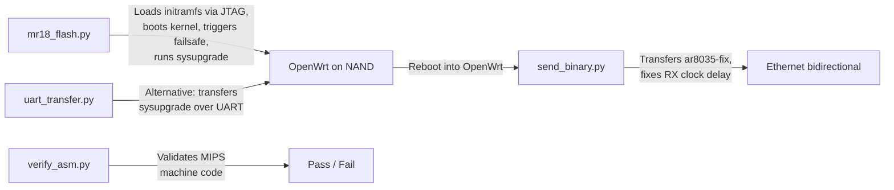
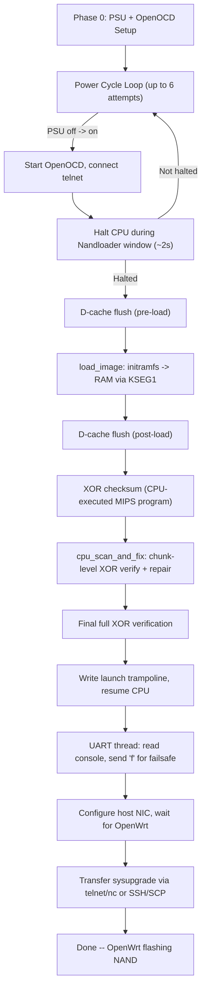
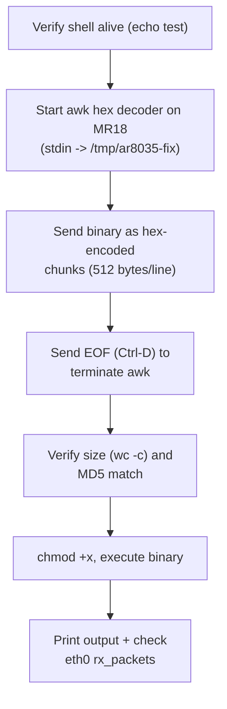
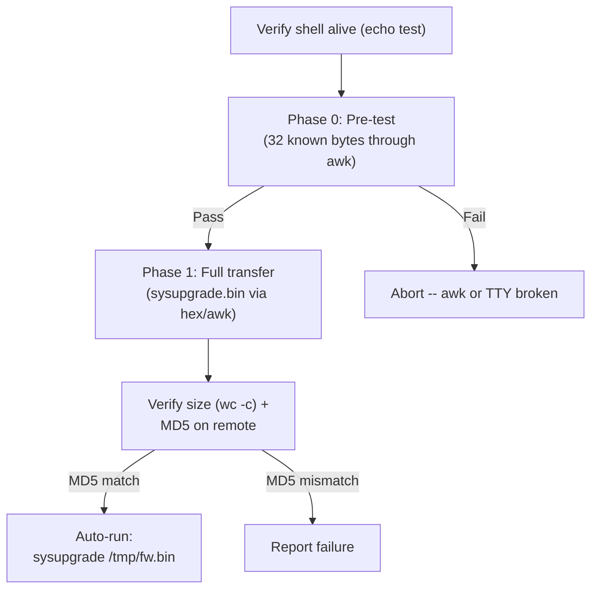

# Script Reference

CLI usage, configuration, and behavior for every script in the project.

## Overview



The normal workflow is:

1. `mr18_flash.py` -- JTAG flash, boot, failsafe, sysupgrade (automated, ~3-5 min)
2. Reboot into OpenWrt from NAND
3. `send_binary.py` -- transfer and run AR8035 PHY fix
4. Install hotplug script for persistence

`uart_transfer.py` is an alternative to the telnet/nc sysupgrade path in `mr18_flash.py`, useful when network transfer fails.

`verify_asm.py` is a development tool, not part of the flash workflow.

---

## jtag/mr18_flash.py

**The main automation script.** Handles the entire flash process from power-off to sysupgrade.

### Usage

```sh
cd jtag/
sudo python3 mr18_flash.py
```

No command-line arguments. All configuration is via constants at the top of the file. Requires root (or appropriate permissions) for NIC configuration and OpenOCD.

### What It Does

The script executes these phases in order:



#### Phase-by-Phase

| Phase | What | Duration |
|-------|------|----------|
| PSU init | Start `scpi-repl`, set 12 V / 1.5 A | ~5 s |
| Power cycle + halt | Power off, power on, start OpenOCD, halt CPU within ~2 s Nandloader window | ~5 s per attempt |
| D-cache pre-flush | Run `FLUSH_TRAMPOLINE` to evict dirty Cisco D-cache lines before overwriting RAM | < 1 s |
| Binary load | `load_image` writes 6.9 MB initramfs to `0xA005FC00` via PRACC | ~70 s at 1000 kHz |
| D-cache post-flush | Repeat cache flush after load (belt-and-suspenders) | < 1 s |
| XOR checksum | 14-word MIPS program XORs all loaded words, stores result, hits SDBBP | < 1 s CPU time |
| Chunk scan | `cpu_scan_and_fix`: 847 x 8 KB chunks, CPU XOR each, rewrite bad chunks | ~60 s scan |
| Final XOR | Re-run full-binary XOR to confirm consistency | < 1 s |
| Launch | Write `J 0xa0060000` trampoline, resume at `0xa0800000` | instant |
| Failsafe | UART thread sends `f\n` when preinit prompt detected; EN pin held LOW as backup | ~20--40 s |
| Network wait | Poll ARP/ICMP/TCP until `192.168.1.1` responds | ~30--90 s |
| Sysupgrade | Transfer sysupgrade via telnet+nc (or SCP fallback), run `sysupgrade -n` | ~30 s |

**Total expected runtime: 3--5 minutes** (including one successful halt attempt).

### Log Files

| File | Contents |
|------|----------|
| `/tmp/openocd.log` | OpenOCD stdout/stderr (JTAG communication, TAP scan, load_image progress) |
| `/tmp/scpi_repl.log` | scpi-repl stdout/stderr (PSU command responses, instrument discovery) |

### Configurable Constants

| Variable | Default | Description |
|----------|---------|-------------|
| `ESPPROG_UART` | `/dev/ttyUSB4` | ESP-Prog UART (FT2232H interface B) serial device |
| `HOST_NIC` | `enx6c1ff71fee83` | Host Ethernet interface name for direct MR18 link |
| `HOST_IP` | `192.168.1.2/24` | Static IP assigned to host NIC |
| `OPENWRT_IP` | `192.168.1.1` | Expected IP of MR18 in failsafe mode |
| `PSU_PIPE` | `/tmp/scpi_pipe` | Named pipe (FIFO) for injecting SCPI commands to scpi-repl |
| `REPL_LOG` | `/tmp/scpi_repl.log` | Log file for scpi-repl output |
| `LOAD_ADDR` | `0xa005FC00` | KSEG1 address for initramfs binary load |
| `ENTRY_ADDR` | `0x80060000` | KSEG0 lzma-loader entry point |
| `ENTRY_KSEG1` | `0xa0060000` | KSEG1 view of entry point |
| `TRAMPOLINE_ADDR` | `0xa0800000` | KSEG1 address for trampoline programs |
| `FAILSAFE_EN_DELAY` | `2.0` | Seconds after kernel launch before asserting EN |
| `FAILSAFE_EN_HOLD` | `40.0` | Seconds to hold EN LOW |
| `OCD_HOST` | `127.0.0.1` | OpenOCD telnet host |
| `OCD_PORT` | `4444` | OpenOCD telnet port |
| `MAX_ATTEMPTS` | `6` | Power-cycle retry limit for CPU halt |

### OpenOCD Configuration Files

The script uses two OpenOCD config files in the `jtag/` directory:

- **`esp-prog.cfg`** -- Interface config for the ESP-Prog (FT2232H channel 0). Sets FTDI VID/PID `0x0403:0x6010`, channel 0, adapter speed 1000 kHz.
- **`mr18.cfg`** -- Target config for the AR9344. Defines the JTAG TAP (`mips_m4k`, big-endian, IR length 5), work area at `0x81000000` (4 KB), and adapter speed 1000 kHz.

---

## jtag/verify_asm.py

**Development tool.** Validates every hand-encoded MIPS machine code word used in `mr18_flash.py` against two independent methods: manual bit-field arithmetic and Capstone disassembly.

### Usage

```sh
cd jtag/
python3 verify_asm.py
```

No command-line arguments. No configuration needed.

### Requirements

- Python 3
- `capstone` Python module (`pip install capstone`)

### What It Verifies

Three instruction sequences:

1. **XOR checksum program** (14 words) -- the MIPS program that computes a running XOR over the loaded binary
2. **Launch trampoline** (2 meaningful words + NOPs) -- the `J 0xa0060000` jump instruction
3. **Flush trampoline** (10 words) -- the `CACHE` instruction loop for D-cache/I-cache invalidation

For each instruction, the script:

1. Encodes using R-type/I-type/J-type helper functions with explicit field arithmetic
2. Compares the computed 32-bit word against the hardcoded constant
3. Disassembles using Capstone as ground truth
4. Prints `[pass]` or `[fail]` for every instruction

### Output

Detailed per-instruction output showing bit-field breakdown and Capstone cross-check. The script exits successfully if all checks pass.

---

## ar8035-fix/send_binary.py

**Transfers the `ar8035-fix` binary to a running MR18 over UART and executes it.** Used after OpenWrt is installed and booted from NAND.

### Usage

```sh
cd ar8035-fix/
python3 send_binary.py
```

No command-line arguments. The MR18 must be booted into OpenWrt with a shell accessible on the UART console.

### What It Does



The transfer uses hex encoding through an awk decoder on the MR18 side, which avoids binary-unsafe characters over the serial link. Each chunk is 512 bytes (1024 hex characters per line), staying safely below busybox awk's line length limits.

The `ar8035-fix` binary performs two MDIO register writes via the Linux socket `ioctl` interface:

1. **Disables AR8035 hibernation** (debug register `0x0B`, clear bit 15)
2. **Enables RGMII RX clock delay** (debug register `0x00`, set bit 15)

### Configurable Constants

| Variable | Default | Description |
|----------|---------|-------------|
| `BINARY` | `ar8035-fix` (same dir) | Path to the compiled MIPS32 ELF binary |
| `UART` | `/dev/ttyUSB4` | ESP-Prog UART serial device |
| `BAUD` | `115200` | Serial baud rate |
| `REMOTE` | `/tmp/ar8035-fix` | Remote path on MR18 where binary is written |
| `CHUNK` | `512` | Bytes per hex-encoded line |

---

## ar8035-fix/uart_transfer.py

**Transfers the sysupgrade image to an MR18 over UART and auto-runs `sysupgrade`.** This is an alternative to the telnet/nc path in `mr18_flash.py`, useful when network-based transfer is unreliable.

### Usage

```sh
cd ar8035-fix/
python3 uart_transfer.py
```

No command-line arguments. The MR18 must be in OpenWrt failsafe mode (or any state with a shell on the UART console).

### What It Does



#### Phase 0: Pre-test

Before committing to the full transfer (which takes ~20 minutes at 115200 baud), the script sends 32 known bytes (`0x00`--`0x1F`) through the awk hex decoder and verifies the MD5 matches. This catches awk formula bugs or TTY corruption early.

#### Phase 1: Full Transfer

The sysupgrade image is hex-encoded and sent line by line (512 bytes = 1024 hex chars per line). A background thread drains UART echo data to prevent buffer overflows. Progress is printed every 500 chunks with throughput and ETA.

After the transfer completes, the script verifies the file size and MD5 on the MR18. If the MD5 matches, it automatically runs `sysupgrade /tmp/fw.bin`.

### Configurable Constants

| Variable | Default | Description |
|----------|---------|-------------|
| `SYSUPGRADE` | `../firmware/openwrt-...-squashfs-sysupgrade.bin` | Path to sysupgrade image (relative to script dir) |
| `UART` | `/dev/ttyUSB4` | ESP-Prog UART serial device |
| `BAUD` | `115200` | Serial baud rate |
| `EXPECTED_MD5` | `53e272bed2041616068c6958fe28a197` | Expected MD5 of sysupgrade image |
| `CHUNK_SIZE` | `512` | Bytes per hex-encoded line |

### Runtime Estimate

At 115200 baud with hex encoding (2x expansion), effective throughput is approximately 5.6 KB/s. The sysupgrade image transfer takes roughly 15--20 minutes depending on UART echo draining overhead.

---

## ar8035-fix/Makefile

**Builds the `ar8035-fix` MIPS32 static ELF binary from `ar8035_start.S` and `ar8035.c`.**

### Targets

| Target | Command | Description |
|--------|---------|-------------|
| `all` (default) | `make` | Cross-compile with `mips-linux-gnu-gcc`, strip, print size |
| `docker` | `make docker` | Build inside Debian Bookworm Docker container (no local cross-compiler needed) |
| `clean` | `make clean` | Remove the `ar8035-fix` binary |

### Build Details

```
CROSS   = mips-linux-gnu-
CC      = $(CROSS)gcc
CFLAGS  = -O2 -msoft-float -mno-abicalls -fno-pic
LDFLAGS = -nostdlib -nostartfiles -Wl,-z,noexecstack -Wl,-e,_start -static
```

The binary is:
- **Freestanding:** no libc, no dynamic linker, no standard library
- **Entry point:** `_start` in `ar8035_start.S` (sets up `$gp`, aligns `$sp`, calls `ar8035_main`)
- **Syscalls:** raw MIPS O32 `syscall` instruction for `write`, `socket`, `ioctl`, `exit`
- **Soft-float:** AR9344 has no hardware FPU (`-msoft-float`)
- **Output size:** ~5592 bytes stripped

---

## All Configurable Variables

Combined table of every user-configurable constant across all scripts:

| Script | Variable | Default | Description |
|--------|----------|---------|-------------|
| `mr18_flash.py` | `ESPPROG_UART` | `/dev/ttyUSB4` | ESP-Prog UART device |
| `mr18_flash.py` | `HOST_NIC` | `enx6c1ff71fee83` | Host Ethernet interface |
| `mr18_flash.py` | `HOST_IP` | `192.168.1.2/24` | Host static IP |
| `mr18_flash.py` | `OPENWRT_IP` | `192.168.1.1` | MR18 failsafe IP |
| `mr18_flash.py` | `PSU_PIPE` | `/tmp/scpi_pipe` | SCPI named pipe path |
| `mr18_flash.py` | `REPL_LOG` | `/tmp/scpi_repl.log` | scpi-repl log file |
| `mr18_flash.py` | `LOAD_ADDR` | `0xa005FC00` | KSEG1 load address |
| `mr18_flash.py` | `ENTRY_ADDR` | `0x80060000` | KSEG0 entry point |
| `mr18_flash.py` | `ENTRY_KSEG1` | `0xa0060000` | KSEG1 entry point |
| `mr18_flash.py` | `TRAMPOLINE_ADDR` | `0xa0800000` | Trampoline base |
| `mr18_flash.py` | `FAILSAFE_EN_DELAY` | `2.0` s | EN assert delay after kernel launch |
| `mr18_flash.py` | `FAILSAFE_EN_HOLD` | `40.0` s | EN hold duration |
| `mr18_flash.py` | `OCD_HOST` | `127.0.0.1` | OpenOCD telnet host |
| `mr18_flash.py` | `OCD_PORT` | `4444` | OpenOCD telnet port |
| `mr18_flash.py` | `MAX_ATTEMPTS` | `6` | Halt retry limit |
| `send_binary.py` | `BINARY` | `./ar8035-fix` | Path to ar8035-fix ELF |
| `send_binary.py` | `UART` | `/dev/ttyUSB4` | Serial device |
| `send_binary.py` | `BAUD` | `115200` | Baud rate |
| `send_binary.py` | `REMOTE` | `/tmp/ar8035-fix` | Remote destination path |
| `send_binary.py` | `CHUNK` | `512` | Bytes per hex line |
| `uart_transfer.py` | `SYSUPGRADE` | `../firmware/...sysupgrade.bin` | Sysupgrade image path |
| `uart_transfer.py` | `UART` | `/dev/ttyUSB4` | Serial device |
| `uart_transfer.py` | `BAUD` | `115200` | Baud rate |
| `uart_transfer.py` | `EXPECTED_MD5` | `53e272bed2041616068c6958fe28a197` | Sysupgrade MD5 |
| `uart_transfer.py` | `CHUNK_SIZE` | `512` | Bytes per hex line |

All scripts default to `/dev/ttyUSB4` for the ESP-Prog UART. If your device enumerates differently (check `ls /dev/ttyUSB*`), edit the `UART` variable at the top of each script.
