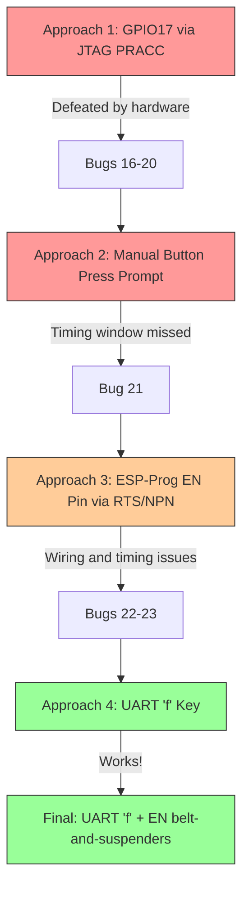

# Failsafe Mode Trigger

How the project enters OpenWrt failsafe mode after booting the initramfs kernel, and the evolution through five failed approaches before arriving at the working solution.

## Why Failsafe Is Necessary

The Meraki MR18's NAND flash contains Cisco's original overlay partition. When OpenWrt boots the initramfs kernel, its preinit sequence mounts this NAND overlay by default. The Meraki overlay contains Cisco's userspace -- management daemons, DHCP client configuration, and cloud-phone-home scripts -- which overrides OpenWrt's networking stack entirely (see [Bug 15](../bugs/bug-15-meraki-nand-overlay.md)).

The result: the device acquires an IP via DHCP as a WAN client instead of coming up at the expected `192.168.1.1`. There is no web UI, no SSH, and no way to flash the sysupgrade image.

## What Failsafe Mode Does

OpenWrt's failsafe mode (triggered during preinit) skips the overlay mount entirely:

- **No NAND overlay:** only the read-only SquashFS root is active
- **Static IP:** `192.168.1.1/24` on the LAN interface
- **Telnet:** `telnetd` on port 23, no password
- **Minimal services:** no firewall, no DHCP server, no DNS -- just a root shell

This gives a clean environment to transfer and flash the sysupgrade image.

## Trigger Evolution



### Approach 1: GPIO17 via JTAG PRACC (Bugs 16-20)

The MR18 reset button is wired to GPIO17 on the QCA9557. OpenWrt's preinit polls this GPIO to detect a failsafe button press. The initial approach: halt the CPU via JTAG, write GPIO registers to drive GPIO17 LOW, resume, and repeat in a loop through the preinit window.

```
halt
mww 0xb8040000 <OE | bit17>     # GPIO_OE: set GPIO17 as output
mww 0xb8040010 0x00020000       # GPIO_CLR: drive GPIO17 LOW
resume
sleep 1.5
# ... repeat for 25 seconds
```

This was defeated by a cascade of hardware issues:

| Bug | Problem |
|-----|---------|
| [Bug 16](../bugs/bug-16-failsafe-timing.md) | Timing too late -- GPIO writes started after the preinit failsafe check window had already passed |
| [Bug 17](../bugs/bug-17-hammer-freezes-cpu.md) | Missing `resume` after halt -- CPU stayed halted, kernel could not advance to preinit |
| [Bug 18](../bugs/bug-18-mdw-mww-silent-fail.md) | OpenOCD's `mdw`/`mww` require the target to be halted; they silently fail on a running target |
| [Bug 19](../bugs/bug-19-gpio-vs-pullup.md) | External pull-up resistors on the GPIO17 net overpower the SoC's GPIO output driver |
| [Bug 20](../bugs/bug-20-reset-supervisor.md) | The MR18 reset supervisor IC actively drives GPIO17 HIGH with a CMOS push-pull output, not just a pull-up -- the SoC's GPIO driver cannot overcome it |

The fundamental problem: GPIO17 is not just a passive pull-up line. The reset supervisor IC on the MR18 board drives it HIGH with enough current that the SoC's GPIO output (even in push-pull mode) cannot pull it LOW. No amount of register manipulation via JTAG can overcome this.

### Approach 2: Manual Button Press Prompt (Bug 21)

After the GPIO approach failed, the script prompted the user to physically press the reset button during the preinit window. The problem ([Bug 21](../bugs/bug-21-manual-prompt-window.md)): the prompt appeared on the host console after the failsafe check window had already closed on the device. The timing margin was too tight for a human to react.

### Approach 3: ESP-Prog EN Pin via RTS/NPN (Bugs 22-23)

The ESP-Prog board's UART connector exposes an EN pin driven by the FT2232H's RTS line through an NPN transistor (the same auto-reset circuit used by esptool.py for ESP32 boards). Wiring this EN pin to the GPIO17 net on the MR18 allows software-controlled "button press" simulation:

```
ser.rts = True   --> NPN conducts --> EN pulled LOW --> GPIO17 LOW
ser.rts = False  --> NPN off       --> EN released   --> pull-up wins --> GPIO17 HIGH
```

Two issues:

| Bug | Problem |
|-----|---------|
| [Bug 22](../bugs/bug-22-resistor-wrong-side.md) | 100 ohm series resistor placed on the wrong side of the NPN transistor (between collector and GPIO17 net instead of at the base), limiting current sink capability |
| [Bug 23](../bugs/bug-23-en-before-boot.md) | EN fires too early -- asserted before the kernel has even booted, well before preinit starts polling GPIO17 |

The EN approach does electrically pull GPIO17 LOW (the NPN transistor can sink more current than the reset supervisor sources), but the timing alignment was wrong.

### Approach 4: UART 'f' Key (The Correct Trigger)

OpenWrt's preinit does not only check the hardware reset button. It also reads keyboard input on the serial console. During the failsafe check window, preinit prints:

```
Press the [f] key and hit [enter] to enter failsafe mode
```

Sending `f\n` over the UART serial connection triggers failsafe mode. This is the primary and most reliable trigger because:

- No hardware contention with the reset supervisor IC
- Timing is self-synchronizing: the script watches UART output for the prompt, then responds
- Works through the same serial connection already used for console output monitoring

## Final Implementation: _uart_en_fn()

The production code in `mr18_flash.py` uses a background thread (`_uart_en_fn`) that combines the UART `f` key trigger with the EN pin toggle as belt-and-suspenders:

### Thread behavior

```python
# Simplified logic of _uart_en_fn()
with serial.Serial(ESPPROG_UART, 115200) as ser:
    while not stop_event.is_set():
        # 1. EN/RTS timing (belt-and-suspenders)
        if elapsed >= FAILSAFE_EN_DELAY and not en_asserted:
            ser.rts = True   # Assert EN (GPIO17 LOW via NPN)
        if elapsed >= FAILSAFE_EN_DELAY + FAILSAFE_EN_HOLD:
            ser.rts = False  # Release EN

        # 2. Read UART console output
        chunk = ser.read(...)
        for line in chunk.lines():
            print(line)  # Show boot progress

            # 3. Primary trigger: UART 'f' key
            if "press the [f] key" in line.lower():
                ser.write(b"f\n")

            # 4. Post-failsafe setup
            if "failsafe" in line and "/#" in line:
                ser.write(b"watchdog kicker command\n")
                ser.write(b"ifconfig eth0 192.168.1.1 ...\n")
                ser.write(b"telnetd -l /bin/sh &\n")
```

### Timing constants

| Constant | Value | Purpose |
|----------|-------|---------|
| `FAILSAFE_EN_DELAY` | 2.0 s | Seconds after kernel launch before asserting EN |
| `FAILSAFE_EN_HOLD` | 40.0 s | Duration to hold EN LOW (blankets entire preinit window) |

The EN assertion window (t=2s to t=42s after launch) is deliberately oversized to cover the full range of possible preinit timing:

| Boot phase | Approximate time after launch |
|------------|------------------------------|
| LZMA decompression | 3-5 s (6.9 MB compressed to ~26 MB) |
| Kernel init, platform probe | 5-8 s |
| gpio-keys driver sets GPIO17 as INPUT | 8-12 s |
| Preinit starts (`/etc/preinit`) | 10-15 s |
| Failsafe button check window | 10-18 s (3 s polling loop) |
| Failsafe network stack up | 20-40 s |

### UART 'f' trigger detail

The UART trigger is event-driven: the thread watches every console line for the preinit failsafe prompt. When it sees `"failsafe mode"` or `"press the [f] key"` in the output, it immediately sends `f\n`. This self-synchronizing approach handles any variation in boot timing.

### Post-failsafe setup

Once the failsafe shell prompt is detected (line containing `"failsafe"` and `"/#"`), the thread sends three commands:

1. **Watchdog kicker:** `( while true; do echo 1 > /dev/watchdog; sleep 5; done ) &` -- The QCA9557 hardware watchdog fires at ~90 s if not fed. Initramfs failsafe mode may not start procd's watchdog feeder.

2. **Network interface:** `ifconfig eth0 192.168.1.1 netmask 255.255.255.0 up` -- Ensures the expected static IP is assigned (failsafe mode may not bring up eth0 by default on all platforms).

3. **Telnet daemon:** `telnetd -l /bin/sh &` -- Starts the telnet server for remote sysupgrade.

After these commands succeed, the `_failsafe_active` event is set, which prevents the main script from power-cycling the device on timeout -- the device is known to be running OpenWrt even if network detection is slow.

## Related Bugs

- [Bug 15](../bugs/bug-15-meraki-nand-overlay.md): Meraki NAND overlay mounts Cisco userspace
- [Bug 16](../bugs/bug-16-failsafe-timing.md): GPIO timing too late
- [Bug 17](../bugs/bug-17-hammer-freezes-cpu.md): Missing resume after halt
- [Bug 18](../bugs/bug-18-mdw-mww-silent-fail.md): mdw/mww require halt
- [Bug 19](../bugs/bug-19-gpio-vs-pullup.md): External pull-ups defeat GPIO drive
- [Bug 20](../bugs/bug-20-reset-supervisor.md): Reset supervisor IC drives HIGH
- [Bug 21](../bugs/bug-21-manual-prompt-window.md): Manual button press prompt too late
- [Bug 22](../bugs/bug-22-resistor-wrong-side.md): EN resistor on wrong side
- [Bug 23](../bugs/bug-23-en-before-boot.md): EN fires before kernel boots

## Cross-references

- [Image Loading](image-loading.md) -- Phase 4 launch that starts the UART thread
- [Script Reference](../reference/script-reference.md) -- Full `mr18_flash.py` usage
- [UART Transfer Protocol](uart-transfer.md) -- Uses the same serial connection for file transfers
