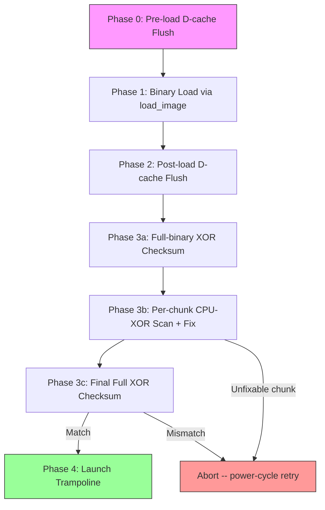

# Image Loading and Verification

The complete load-verify-fix-launch pipeline implemented in `jtag/mr18_flash.py`. Transfers a 6.9 MB OpenWrt initramfs kernel into DRAM over JTAG PRACC at ~97 KB/s, verifies it against PRACC bit-flip corruption, repairs bad chunks, and launches the lzma-loader decompressor.

## Pipeline Overview



## Phase 0: Pre-load D-cache Flush

**Why BEFORE the load, not after:** The Cisco Nandloader writes the Cisco kernel to physical `0x5FC00` via KSEG0 (cached, write-back, write-allocate on AR9344). This fills D-cache lines at that physical range with dirty Cisco data -- the actual DRAM content lags behind the cache.

Our `load_image` writes OpenWrt to the same physical range via KSEG1 (uncached, bypasses D-cache, goes straight to DRAM). But the D-cache still holds those dirty Cisco lines. When the lzma-loader later reads via KSEG0, the MIPS cache controller evicts dirty lines with write-back -- **overwriting our freshly loaded OpenWrt binary with stale Cisco data.** Result: `data error!` from the lzma-loader (see [Bug 13](../bugs/bug-13-flush-ordering.md)).

If we flushed *after* `load_image`, the write-back of stale Cisco lines would corrupt our binary. Flushing *before* ensures the dirty lines are written back to DRAM (harmless, since we overwrite that DRAM immediately) and the D-cache is clean before the load begins.

### D_CACHE_FLUSH_TRAMPOLINE

An 8-word MIPS program written to `0xa0800000` (KSEG1, uncached) via `mww`:

| Word | Instruction | Encoding | Purpose |
|------|-------------|----------|---------|
| 0 | `lui t0, 0x8000` | `0x3C088000` | t0 = 0x80000000 (start of KSEG0) |
| 1 | `lui t1, 0x8002` | `0x3C098002` | t1 = 0x80020000 (start + 128 KB) |
| 2 | `lw t2, 0(t0)` | `0x8D0A0000` | **LOOP:** KSEG0 read evicts one dirty D-cache line |
| 3 | `addiu t0, t0, 32` | `0x25080020` | Advance by cache line size (32 bytes) |
| 4 | `bne t0, t1, -3` | `0x1509FFFD` | Loop while t0 < end |
| 5 | `nop` | `0x00000000` | Branch delay slot |
| 6 | `sdbbp` | `0x7000003F` | CPU enters debug mode; OpenOCD detects halt |
| 7 | `nop` | `0x00000000` | Padding |

The 128 KB read loop (4096 cache lines at 32 bytes each) covers all 4 ways of the AR9344 D-cache, ensuring every dirty line is written back and invalidated.

### Execution sequence

1. Write 8 words to `0xa0800000` via `mww`
2. Verify each word with `mdw` readback (abort if any corrupt)
3. `resume 0xa0800000` -- CPU executes the flush loop
4. `wait_halt 2000` -- SDBBP fires in ~0.073 ms
5. Verify PC landed at `0xa0800018` (word 6, the SDBBP instruction)

## Phase 1: Binary Load via OpenOCD load_image

```
load_image <initramfs_path> 0xa005FC00 bin
```

- **Target address:** KSEG1 `0xa005FC00` -- uncached, bypasses D-cache, writes go straight to physical DRAM
- **Transfer mechanism:** EJTAG PRACC (Processor Access) -- OpenOCD feeds 32-bit words through the debug interface
- **Throughput:** ~97 KB/s at 1000 kHz JTAG clock
- **Duration:** ~70 seconds for 6,931,053 bytes (6.9 MB)
- **Post-load re-halt:** `load_image` can leave the target in a running state; the script explicitly issues `halt` + `wait_halt 2000` afterwards (see [Bug 9](../bugs/bug-09-trampoline-overlap.md))

The load address `0xa005FC00` is 0x400 bytes below the lzma-loader entry point `0xa0060000`. This 1024-byte gap contains the kernel image header that the lzma-loader parses to locate the compressed data stream. See [address-map.md](../reference/address-map.md) for derivation.

## Phase 2: Post-load D-cache Flush (Belt-and-Suspenders)

Repeats the exact same `D_CACHE_FLUSH_TRAMPOLINE` sequence as Phase 0. While `load_image` uses KSEG1 (uncached) and should not introduce dirty D-cache lines, any speculative fetches or pipeline stalls during PRACC writes that touch KSEG0 could leave residual lines. This guarantees a clean slate before the lzma-loader launches.

Same write-verify-resume-halt-check sequence as Phase 0.

## Phase 3a: Full-binary XOR Checksum

A 14-word MIPS program that XORs every 32-bit word in the loaded binary and stores the result at a known address. The CPU runs this at 560 MHz (not at PRACC speed), completing in ~25 ms.

### make_checksum_program()

| Word | Instruction | Purpose |
|------|-------------|---------|
| 0 | `lui t0, hi(start)` | Load start address high half |
| 1 | `ori t0, t0, lo(start)` | Complete start address |
| 2 | `lui t1, hi(end)` | Load end address high half |
| 3 | `ori t1, t1, lo(end)` | Complete end address |
| 4 | `addiu t2, $0, 0` | Accumulator = 0 |
| 5 | `lw t3, 0(t0)` | **LOOP:** Load word from binary |
| 6 | `xor t2, t2, t3` | XOR into accumulator |
| 7 | `addiu t0, t0, 4` | Advance to next word |
| 8 | `bne t0, t1, -4` | Loop until end |
| 9 | `nop` | Delay slot |
| 10 | `lui t4, hi(result_base)` | Load result address |
| 11 | `sw t2, 0x40(t4)` | Store XOR result at TRAMPOLINE_ADDR + 0x40 |
| 12 | `sdbbp` | Halt |
| 13 | `nop` | Padding |

- **Result location:** `0xa0800040` (TRAMPOLINE_ADDR + 0x40, past the 14-word program)
- **Expected value:** `0xf524142e` (precomputed by `compute_xor32()` in Python)
- **Verification:** read result via `mdw`, confirm PC at SDBBP address
- **Retries:** up to 3 attempts if SDBBP is not reached

### XOR limitation (Bug 10)

XOR is a weak checksum: if two corrupted words have the same XOR delta, they cancel out and the full-binary XOR appears correct. For a 6.9 MB binary with ~5 expected PRACC bit-flip errors (see [Bug 4](../bugs/bug-04-pracc-bit-errors.md)), the probability of exact cancellation is low but nonzero. This is why Phase 3b exists -- the chunk-level scan makes cancellation astronomically unlikely within any single 8 KB chunk. See [Bug 10](../bugs/bug-10-xor-cancellation.md).

## Phase 3b: Per-chunk CPU-XOR Scan (cpu_scan_and_fix)

The core corruption detection and repair mechanism. Replaced the earlier `verify_and_fix` approach that used PRACC reads (`dump_image`), which suffered from the same bit-flip rate as writes -- causing phantom errors where correct data appeared bad and real errors appeared correct (see [Bug 8](../bugs/bug-08-phantom-verify-errors.md)).

### Design

- **Chunk size:** 8192 bytes (8 KB)
- **Total chunks:** 847 (for a 6.9 MB binary)
- **PRACC operations per chunk:** only 5
  - 4 program header writes (words 0-3: start/end addresses for this chunk)
  - 1 result read (XOR value at `0xa0800040`)
- **Constant program body:** words 4-13 are written once and reused across all chunks

### Per-chunk flow

1. Compute expected XOR for this chunk from file bytes (Python-side)
2. Write words 0-3 of the checksum program (chunk start/end addresses) via `mww`
3. Verify words 0-3 via `mdw` readback
4. Clear result slot: `mww 0xa0800040 0x00000000`
5. `resume 0xa0800000` -- CPU runs XOR loop over this 8 KB chunk
6. `wait_halt 5000` -- SDBBP fires in < 1 ms per chunk
7. Read result via `mdw`; compare against expected XOR

### Bad chunk repair

When a chunk XOR mismatches:

1. Rewrite the entire 8 KB chunk from file bytes via `mww` (2048 individual word writes)
2. Re-run CPU XOR to verify the rewrite
3. Retry up to 3 times per chunk before aborting

This eliminates guessing which words within a chunk are bad. The full chunk rewrite is slow (~2 seconds per chunk) but reliable since only ~5 chunks out of 847 are typically affected (see [Bug 7](../bugs/bug-07-flush-trampoline.md)).

### Why cpu_scan_and_fix replaced verify_and_fix

The original `verify_and_fix` used `dump_image` (PRACC reads) to read back the entire binary and compare against the file. The problem (see [Bug 8](../bugs/bug-08-phantom-verify-errors.md)): PRACC reads have the same ~5 bit-flip per MB error rate as writes. A correct word in RAM could be read back wrong (false positive), and a corrupted word could be read back as the expected value (false negative). The verify step was as unreliable as the load step.

`cpu_scan_and_fix` avoids this by having the CPU itself do the comparison. The CPU reads RAM through the L1 cache at 560 MHz with zero bit errors -- only the 5 PRACC operations per chunk are subject to JTAG noise.

## Phase 3c: Final Full XOR After Chunk Scan

Repeats the Phase 3a full-binary XOR checksum after all chunk repairs. This confirms that the chunk scan + repair process left the binary in a globally consistent state. Both the per-chunk XOR results and the full-binary XOR must agree before launch proceeds.

If the final XOR mismatches, the script aborts and the outer power-cycle retry loop starts a fresh attempt.

## Phase 4: Launch

### LAUNCH_TRAMPOLINE

A 2-word (plus padding) program at `0xa0800000`:

| Word | Instruction | Encoding | Purpose |
|------|-------------|----------|---------|
| 0 | `j 0xa0060000` | `0x08018000` | Jump to lzma-loader entry (KSEG1, uncached) |
| 1 | `nop` | `0x00000000` | Jump delay slot |
| 2-9 | `nop` | `0x00000000` | Padding |

The `j` instruction target encoding: `0xa0060000 >> 2 = 0x02818000`, but the MIPS `j` instruction uses bits [27:2] ORed with the PC's bits [31:28]. Since the trampoline is at `0xa0800000` (bits [31:28] = `0xa`), the target `0xa0060000` shares the same high nibble, so the 26-bit field is `0x0018000` and the full encoding is `0x08018000`.

### Launch sequence

1. Write LAUNCH_TRAMPOLINE to `0xa0800000` via `mww`
2. Verify word 0 via `mdw` readback
3. `resume 0xa0800000` -- CPU jumps to lzma-loader entry
4. The UART failsafe thread starts immediately (see [failsafe-trigger.md](failsafe-trigger.md))

After resume, JTAG/EJTAG is not used again. The kernel boots, decompresses, and the UART thread handles failsafe mode entry.

## Timing Summary

| Phase | Duration | Notes |
|-------|----------|-------|
| Phase 0: Pre-load D-cache flush | < 1 s | 0.073 ms CPU time + PRACC overhead |
| Phase 1: load_image | ~70 s | 6.9 MB at ~97 KB/s |
| Phase 2: Post-load D-cache flush | < 1 s | Same as Phase 0 |
| Phase 3a: Full XOR | < 2 s | ~25 ms CPU time + program write overhead |
| Phase 3b: Chunk scan | ~60 s | 847 chunks, ~12 PRACC ops each |
| Phase 3b: Chunk repair | ~2 s/chunk | Only for ~5 bad chunks |
| Phase 3c: Final XOR | < 2 s | Same as Phase 3a |
| Phase 4: Launch | < 1 s | 2-word trampoline write + resume |
| **Total** | **~135 s** | **~2.25 minutes** |

## Related Bugs

- [Bug 4](../bugs/bug-04-pracc-bit-errors.md): PRACC bit-flip errors during JTAG writes (~5 per MB)
- [Bug 7](../bugs/bug-07-flush-trampoline.md): Corruption rate characterization driving chunk size choice
- [Bug 8](../bugs/bug-08-phantom-verify-errors.md): PRACC reads have same bit-flip rate as writes (phantom errors in verify_and_fix)
- [Bug 9](../bugs/bug-09-trampoline-overlap.md): load_image leaves target running
- [Bug 10](../bugs/bug-10-xor-cancellation.md): XOR cancellation can mask paired errors
- [Bug 11](../bugs/bug-11-dcache-stale-data.md): Trampoline clobbered by binary load (drove TRAMPOLINE_ADDR to 0xa0800000)
- [Bug 13](../bugs/bug-13-flush-ordering.md): D-cache flush must happen BEFORE load, not after

## Cross-references

- [MIPS Memory Model](mips-memory-model.md) -- KSEG0/KSEG1 semantics, D-cache write-back behavior
- [MIPS Assembly](mips-assembly.md) -- instruction encoding, branch offsets, delay slots
- [Address Map](../reference/address-map.md) -- all address constants with derivations
- [Script Reference](../reference/script-reference.md) -- CLI usage for `mr18_flash.py`
