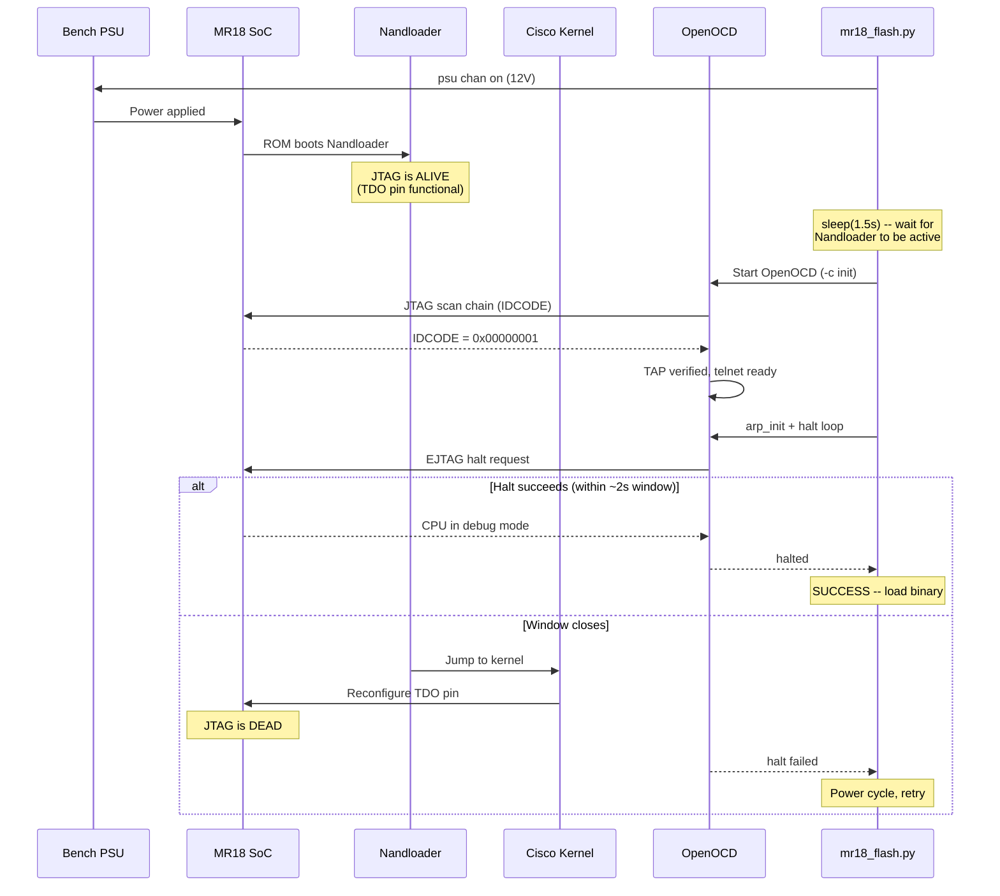

# The JTAG Timing Attack

How the script exploits a narrow window during the MR18's boot sequence to halt the CPU via EJTAG before Cisco's Linux kernel disables JTAG access. This is the first and most critical step of the entire flash process -- everything else depends on getting a halted CPU.

## MR18 Boot Sequence

When the MR18 powers on, the following sequence executes:

1. **Power-on reset**: AR9344 SoC initializes from internal ROM
2. **Nandloader** (Meraki's bootloader in NAND flash): initializes DDR RAM, reads the Cisco kernel image from NAND, copies it to physical `0x0005FC00` via KSEG0
3. **Cisco Linux kernel**: Nandloader jumps to the kernel entry point. The kernel initializes the platform, including GPIO pin muxing
4. **TDO pin reconfiguration**: The Linux kernel (or its platform init code) reconfigures the GPIO pin that carries TDO (JTAG Test Data Out) for an alternate function, breaking the JTAG scan chain
5. **JTAG is dead**: After this point, OpenOCD cannot communicate with the EJTAG TAP -- the scan chain is physically broken

Steps 1-3 take approximately **2 seconds** from power-on. Step 4 happens within the first second of kernel execution. The total window between "Nandloader is running and JTAG is alive" and "kernel has killed JTAG" is roughly **2 seconds**.



## Why OpenOCD Must Start After Power-On

**Bug 2** was caused by starting OpenOCD before powering on the MR18. The sequence was:

1. Start OpenOCD (with `-c init`)
2. OpenOCD scans JTAG chain -- all lines are floating (no power), no devices found
3. OpenOCD reports TAP scan failure and enters an error state
4. Power on MR18
5. MR18 is alive but OpenOCD already failed -- cannot communicate

The fix is straightforward: power on first, wait for the Nandloader to be running (~1.5 seconds), then start OpenOCD so it scans a live JTAG chain.

## Power-Cycle Automation

The script uses a SCPI-controlled bench power supply (via the `scpi-repl` tool) to automate power cycling:

```python
psu("psu chan off")    # Cut power -- MR18 powers down
time.sleep(2.5)        # Wait for capacitors to discharge
psu("psu chan on")     # Apply 12V -- MR18 boots
time.sleep(1.5)        # Wait for Nandloader
```

The 2.5-second off period ensures the SoC fully resets (capacitor discharge). The 1.5-second on delay is the empirically determined sweet spot: long enough for the Nandloader to have initialized DRAM and the JTAG TAP, short enough that the kernel has not yet killed JTAG.

## Halt Strategy

Once OpenOCD is connected, the script has roughly 0.5 seconds remaining in the JTAG window (1.5s already elapsed waiting for Nandloader). The halt strategy is a tight loop combining three methods:

### Method 1: High-Level Halt

```python
resp = ocd.cmd("halt", timeout=2.0)
resp2 = ocd.cmd("wait_halt 300", timeout=1.0)
```

OpenOCD's `halt` command sends a standard EJTAG debug exception request. `wait_halt 300` blocks for up to 300ms waiting for the CPU to enter debug mode. This works when the TAP is responsive and the CPU is not in a state that ignores debug exceptions.

### Method 2: Raw EJTAG Halt

When the high-level halt fails (common during the timing-critical window), the script falls back to direct EJTAG register manipulation:

```python
ocd.cmd(f"irscan ar9344.cpu {EJTAG_IR}")         # Select EJTAG control register (IR=0x0a)
ocd.cmd(f"drscan ar9344.cpu 32 {wr_val}")         # Write PROBEN|JTAGBRK|BIT3 = 0x9008
```

This bypasses OpenOCD's target layer and directly manipulates the EJTAG control register through raw TAP shifts:

1. **`irscan 0x0a`**: Load instruction register with `0x0a`, selecting the EJTAG Control register for data register access
2. **`drscan 32 0x00009008`**: Shift 32 bits through the data register with:
   - Bit 15 (`PROBEN` = `0x8000`): Enable processor access (required for JTAGBRK to work)
   - Bit 12 (`JTAGBRK` = `0x1000`): Request debug break
   - Bit 3 (`0x0008`): Always set (EJTAG spec requirement)

After writing, the script polls the control register for the `BRKST` bit:

```python
resp = ocd.cmd("drscan ar9344.cpu 32 0x00000000")
val = int(resp.split()[-1], 16)
if val & EJTAG_BRKST:   # Bit 11 = 0x0800
    # CPU is halted in debug mode
```

A `drscan` with value `0x00000000` reads the current control register state without modifying control bits. If bit 11 (`BRKST` = `0x0800`) is set, the CPU has entered debug mode.

If `PROBEN` gets cleared between polls (which can happen if the CPU resets the EJTAG control register), the script re-asserts the halt request:

```python
if not (val & EJTAG_PROBEN):
    ocd.cmd(f"irscan ar9344.cpu {EJTAG_IR}")
    ocd.cmd(f"drscan ar9344.cpu 32 {wr_val}")
```

### Method 3: TAP Re-Initialization

Before the halt loop, the script re-initializes the TAP to ensure OpenOCD's internal state matches the hardware:

```python
ocd.cmd("jtag arp_init", timeout=3.0)       # Re-scan chain
ocd.cmd("ar9344.cpu arp_examine", timeout=2.0)  # Re-examine target
```

This is necessary because the TAP state can become stale if the previous halt attempt left the scan chain in an unexpected state.

### The Halt Loop

All three methods are combined in a tight loop with a 1-second deadline:

```python
t0 = time.monotonic()
while time.monotonic() - t0 < 1.0:
    if try_halt_once(ocd):     # Method 1: halt + wait_halt
        halted = True
        break
    if try_halt_ejtag(ocd):    # Method 2: raw EJTAG
        halted = True
        break
    time.sleep(0.02)           # 20ms between attempts
```

At 20ms per iteration, this gives approximately 50 halt attempts within the remaining JTAG window.

## EJTAG Register Details

| Field | Value | Bits | Purpose |
|-------|-------|------|---------|
| IR value | `0x0a` | 5-bit | Selects EJTAG Control register |
| PROBEN | `0x8000` | Bit 15 | Processor Access Enable |
| JTAGBRK | `0x1000` | Bit 12 | Request debug break |
| BRKST | `0x0800` | Bit 11 | Break status (read-only, 1 = in debug mode) |
| BIT3 | `0x0008` | Bit 3 | Reserved, always set |
| HALT_WR | `0x9008` | - | Combined write value: PROBEN + JTAGBRK + BIT3 |

The halt write value `0x9008` decomposes as:

```
0x9008 = 0x8000 | 0x1000 | 0x0008
       = PROBEN | JTAGBRK | BIT3
       = 1001 0000 0000 1000 (binary)
```

## Non-Standard CPUTAPID

The QCA9557 / AR9344 returns IDCODE `0x00000001`. Per IEEE 1149.1, a valid IDCODE has bit 0 = 1 (to distinguish it from the BYPASS register), with the remaining bits encoding manufacturer (bits 1-11), part number (bits 12-27), and version (bits 28-31). Qualcomm/Atheros set all these fields to zero, yielding the minimal valid IDCODE.

This means OpenOCD cannot auto-detect the chip from the IDCODE alone. The `mr18.cfg` file must explicitly specify the expected ID and all target parameters.

## Retry Logic

The entire power-cycle + halt sequence is wrapped in a retry loop:

```python
MAX_ATTEMPTS = 6

for attempt in range(1, MAX_ATTEMPTS + 1):
    # 1. Power off, kill stale OpenOCD
    psu("psu chan off")
    kill_openocd()
    time.sleep(2.5)

    # 2. Power on, wait for Nandloader
    psu("psu chan on")
    time.sleep(1.5)

    # 3. Start OpenOCD, connect telnet
    proc = start_openocd()
    ocd.connect(retries=15)

    # 4. Tight halt loop (1s deadline)
    # ... try_halt_once + try_halt_ejtag ...

    if halted:
        break
```

Six attempts provide a high probability of success. The timing window is tight but not impossibly narrow -- empirically, the halt succeeds on the first or second attempt in most runs. The retry mechanism handles cases where:

- The Nandloader takes slightly longer or shorter than expected (Bug 5)
- OpenOCD's TAP scan happens to coincide with a Nandloader operation that briefly tristates the JTAG pins (Bug 6)
- USB latency on the host adds unpredictable delays to the first JTAG transaction

## Cross-References

- [Bug 2](../bugs/bug-02-openocd-timing.md): OpenOCD started before power-on -- dead TAP scan
- [Bug 5](../bugs/bug-05-hardware-watchdog.md): Timing window too narrow with original delays
- [Bug 6](../bugs/bug-06-named-pipe-eof.md): Intermittent TAP scan failures during Nandloader
