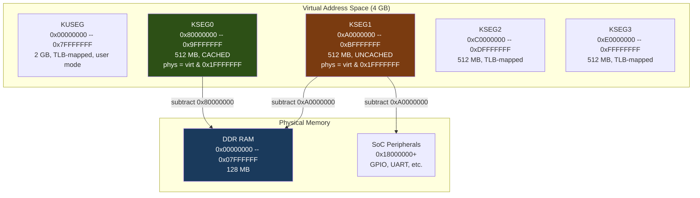

# MIPS Memory Model and Cache Coherency

How the MIPS32 virtual memory architecture, AR9344 D-cache parameters, and the interaction between cached and uncached address segments create the central technical challenge of this project: keeping JTAG-loaded binary data coherent with what the CPU actually reads.

## MIPS32 Virtual Memory Segments

MIPS32 divides the 4 GB virtual address space into fixed segments. The two kernel segments KSEG0 and KSEG1 are hardwired translations -- no TLB configuration is required. This is critical for bare-metal JTAG work because we are operating before any OS has configured the TLB.

| Segment | Virtual Range | Size | Cached | Mapping |
|---------|--------------|------|--------|---------|
| KUSEG   | `0x00000000` -- `0x7FFFFFFF` | 2 GB | Configurable | TLB-mapped (user mode) |
| KSEG0   | `0x80000000` -- `0x9FFFFFFF` | 512 MB | Yes | `phys = virt & 0x1FFFFFFF` |
| KSEG1   | `0xA0000000` -- `0xBFFFFFFF` | 512 MB | No (uncached) | `phys = virt & 0x1FFFFFFF` |
| KSEG2   | `0xC0000000` -- `0xDFFFFFFF` | 512 MB | Configurable | TLB-mapped (kernel) |
| KSEG3   | `0xE0000000` -- `0xFFFFFFFF` | 512 MB | Configurable | TLB-mapped (kernel) |

### Physical Address Derivation

For KSEG0 and KSEG1, the physical address is derived by masking off the top 3 bits:

```
physical = virtual & 0x1FFFFFFF
```

This means:

- `0x80060000` (KSEG0) maps to physical `0x00060000`
- `0xA0060000` (KSEG1) maps to physical `0x00060000`
- `0xB8040000` (KSEG1) maps to physical `0x18040000` (GPIO MMIO registers)

Both KSEG0 and KSEG1 map to the same 512 MB of physical address space. The only difference is whether accesses go through the CPU cache.

### Memory Segment Map



### KSEG0 vs KSEG1: Same Physical Memory, Different Caching

This is the single most important concept for understanding the bugs in this project. Given a physical address like `0x00060000`:

- A read via KSEG0 (`0x80060000`) goes through the D-cache. If the cache has a line for that address, the cached value is returned, even if physical RAM holds something different.
- A read via KSEG1 (`0xA0060000`) bypasses the D-cache entirely and reads physical RAM directly.
- A write via KSEG1 goes straight to physical RAM. The D-cache is not informed and is not updated.

This duality is what makes KSEG1 ideal for JTAG writes (we want data in physical RAM, not stuck in cache) and KSEG0 ideal for CPU execution (cached reads are fast). But it also creates coherency hazards when code running via KSEG0 encounters stale D-cache lines.

## AR9344 Cache Parameters

The AR9344 (QCA9557) SoC has a MIPS 74Kc core with the following data cache configuration:

| Parameter | Value |
|-----------|-------|
| D-cache total size | 32 KB |
| Associativity | 4-way set-associative |
| Line size | 32 bytes |
| Number of sets | 256 (32768 / 4 / 32) |
| Write policy | Write-back, write-allocate |
| I-cache total size | 32 KB |
| I-cache line size | 32 bytes |

**Write-back** means dirty cache lines are not written to physical RAM immediately. They remain in the cache and are only written back when evicted (due to LRU replacement or an explicit cache flush instruction).

**Write-allocate** means that a write to an address not currently in the cache will first allocate a cache line, read the surrounding data from RAM into the line, then modify the relevant bytes. This means even a single-word write can pull 32 bytes of stale RAM data into the cache.

## The D-Cache Dirty Line Problem

This is the root cause of bugs 11, 12, and 13. Understanding it requires tracing the exact sequence of memory operations from Nandloader through our JTAG load.

### Step 1: Nandloader Fills D-Cache with Cisco Data

When the MR18 powers on, the Nandloader reads the Cisco kernel from NAND flash and writes it to physical address `0x0005FC00` via **KSEG0** (address `0x8005FC00`). Because KSEG0 is cached and the AR9344 uses write-back/write-allocate:

- Each 32-byte write allocates a D-cache line
- The Cisco kernel data sits in D-cache lines marked **dirty** (modified but not yet written back to physical RAM)
- Physical RAM at `0x0005FC00+` may lag behind -- some data may still be in-flight or only in cache

After the Nandloader finishes, the D-cache contains dirty lines covering the physical address range `0x0005FC00` through approximately `0x0005FC00 + sizeof(cisco_kernel)`.

### Step 2: JTAG Writes Our Binary via KSEG1

We halt the CPU and use OpenOCD's `load_image` to write our OpenWrt initramfs binary to `0xA005FC00` (KSEG1). Because KSEG1 is uncached:

- Every write goes directly to physical RAM
- The D-cache is **not informed** -- it still holds dirty Cisco data for those same physical addresses
- Physical RAM now contains our OpenWrt binary

At this point, physical RAM is correct, but the D-cache is stale.

### Step 3: LRU Eviction Overwrites Our Binary

When the CPU resumes and the lzma-loader begins executing via KSEG0, it performs various reads that sweep through the D-cache's index space. The LRU eviction policy means:

1. A KSEG0 read needs a cache line for some address
2. The cache set is full -- it must evict the least-recently-used line
3. The evicted line happens to be a dirty Cisco line covering physical `0x0005FC00+`
4. **Write-back fires**: the dirty Cisco data is written from cache to physical RAM
5. Our OpenWrt binary in physical RAM is now partially overwritten with Cisco data

The lzma-loader then reads the (now corrupted) LZMA stream and fails with "data error!".

### Why This Is Insidious

The corruption is non-deterministic. Which Cisco lines get evicted depends on the exact access pattern of the lzma-loader, which depends on the decompression state, which depends on the compressed data. Different regions of our binary get corrupted on different runs. The symptom (lzma decompression failure) is far removed from the cause (cache eviction during unrelated reads).

## D-Cache Flush Strategy

### The Solution: Flush Before Load

The fix is to flush the entire D-cache **before** `load_image`. This writes back all dirty Cisco lines to physical RAM (harmless -- we are about to overwrite that RAM anyway) and marks all cache lines as clean/invalid.

The `D_CACHE_FLUSH_TRAMPOLINE` in `mr18_flash.py` accomplishes this:

```
0  lui  t0, 0x8000        # t0 = 0x80000000 (start of KSEG0)
1  lui  t1, 0x8002        # t1 = 0x80020000 (start + 128 KB)
2  lw   t2, 0(t0)         # LOOP: KSEG0 read (evicts dirty line via LRU)
3  addiu t0, t0, 32       # advance by cache line size
4  bne  t0, t1, -3        # loop until t0 == t1
5  nop                    # branch delay slot
6  sdbbp                  # halt -- signal completion to OpenOCD
7  nop
```

This is a simple LW (load word) loop that reads every 32-byte cache line from KSEG0 `0x80000000` to `0x80020000` (128 KB). The reads themselves are not interesting -- what matters is the side effect: each read potentially evicts a dirty line from a different cache set, forcing its write-back to physical RAM.

### Why 128 KB (4x D-Cache Capacity)

The D-cache is 32 KB with 4-way set associativity. A single 32 KB sweep only touches one way per set. To guarantee that all 4 ways of every set are evicted, the sweep must cover 4 times the cache size:

```
4 ways x 32 KB per way = 128 KB total sweep
```

After sweeping 128 KB of sequential KSEG0 addresses, every cache line in every set has been replaced by data from the sweep range. All original dirty lines (including the Cisco data) have been evicted with write-back.

### Why Plain LW, Not Privileged CACHE Instructions

The initial approach (Bug 7) used the `CACHE` instruction (`cache 0x01, 0(t0)` -- D-cache Index Writeback Invalidate) to flush each line. This is the "correct" way to flush the D-cache, but it caused problems: the CACHE instruction is privileged, and depending on the EJTAG debug state and CP0 configuration at the time of the halt, it could generate exceptions or have no effect.

The `D_CACHE_FLUSH_TRAMPOLINE` uses plain `lw` instructions instead. A load from KSEG0 is an unprivileged memory access that always works. The flush is achieved indirectly through LRU eviction rather than explicitly through cache management instructions. This is slower (128 KB of reads vs targeted invalidations) but completely reliable.

The `FLUSH_TRAMPOLINE` (which uses CACHE instructions) is still present in the code and is used for the post-load belt-and-suspenders flush, but the critical pre-load flush uses the LW-based approach.

### Why the Flush Must Run BEFORE the Load, Not After

Bug 13 was the mistake of running the D-cache flush **after** `load_image` instead of before. The reasoning seemed sound: "flush the cache after loading to ensure coherency." But the timing is backwards:

1. `load_image` writes our OpenWrt binary to physical RAM via KSEG1 (correct)
2. D-cache still has dirty Cisco lines (unchanged by KSEG1 writes)
3. Flush trampoline runs via KSEG0 -- the flush loop's own KSEG0 reads cause LRU eviction
4. Dirty Cisco lines are evicted with write-back -- **overwriting our freshly loaded OpenWrt binary**

The write-back of stale Cisco data happens during the flush itself, because the flush loop touches KSEG0 addresses that share cache sets with the Cisco data range. The flush that was supposed to protect our binary is the thing that destroys it.

The correct order:

1. **Flush first**: evict all dirty Cisco lines (writes Cisco data to RAM -- harmless)
2. **Load second**: `load_image` writes OpenWrt to physical RAM via KSEG1
3. D-cache is now clean (no dirty lines covering our binary's address range)
4. When the CPU reads via KSEG0, cache misses fetch from physical RAM, which contains our correct binary

## Cross-References

- [Bug 7](../bugs/bug-07-flush-trampoline.md): CACHE instruction failures in early flush trampoline
- [Bug 11](../bugs/bug-11-dcache-stale-data.md): D-cache coherency causing lzma "data error!"
- [Bug 12](../bugs/bug-12-beq-vs-bne.md): BEQ/BNE encoding error in flush trampoline branch
- [Bug 13](../bugs/bug-13-flush-ordering.md): Post-load flush destroying the loaded binary
- [Address Map](../reference/address-map.md): Full address constant reference
