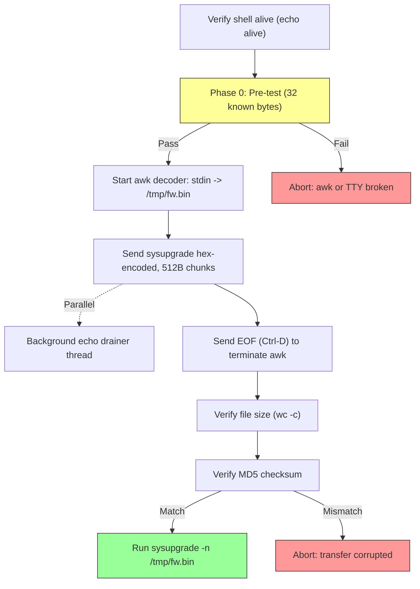

# UART Transfer Protocol

How binary files are transferred to the MR18 over a serial UART connection using hex encoding, decoded on-target by busybox `awk`.

## Why UART

After the initramfs kernel boots into failsafe mode, Ethernet RX is broken due to the AR8035 RGMII RX clock delay bug (see [ar8035-phy-fix.md](ar8035-phy-fix.md)). The host can send packets to the MR18 (TX works), but the MR18 cannot receive any packets from the host. This makes network-based transfers (SCP, nc, wget) impossible in both directions.

The serial console (115200 baud, 8N1) carried on the ESP-Prog's FT2232H interface B (`/dev/ttyUSB4`) is the only working bidirectional channel. Both scripts -- `uart_transfer.py` (sysupgrade image) and `send_binary.py` (ar8035-fix binary) -- use the same hex-over-UART protocol.

## Hex Encoding

Binary data cannot be sent raw over the serial console because:
- The shell and terminal layer interpret control characters (0x00-0x1F)
- Busybox `awk` processes line-oriented text, not binary streams
- The tty layer may strip or transform bytes (e.g., CR/LF conversion)

The solution: encode every byte as two hex ASCII characters (`0x00` becomes `"00"`, `0xFF` becomes `"ff"`). This doubles the transfer size but guarantees the data passes through the tty layer intact.

## The awk Decoder

On the MR18 target, a busybox `awk` one-liner decodes hex back to binary:

```sh
awk 'BEGIN{h="0123456789abcdef"}{for(i=1;i<=length($0);i+=2)printf"%c",(index(h,tolower(substr($0,i,1)))-1)*16+(index(h,tolower(substr($0,i+1,1)))-1)}' > /tmp/fw.bin
```

### How it works

For each pair of hex characters on each input line:

1. `substr($0, i, 1)` -- extract the high nibble character
2. `index(h, ...)` -- find its 1-based position in `"0123456789abcdef"`
3. Subtract 1 to get the 0-based value (0-15)
4. Multiply by 16 (shift left 4 bits)
5. Repeat for the low nibble character at position `i+1`
6. Add the two nibble values to get the byte (0-255)
7. `printf "%c"` -- output the byte

Example: hex `"4f"` becomes `(index("0123456789abcdef","4")-1)*16 + (index("0123456789abcdef","f")-1)` = `(5-1)*16 + (16-1)` = `64 + 15` = `79` = ASCII `'O'`.

The `awk` process reads from stdin (the serial console) and writes binary output to a file. It terminates when it receives EOF (Ctrl-D, `0x04`).

## Chunk Size

Each hex line encodes 512 bytes of binary data (1024 hex characters per line). This value was chosen to stay safely below busybox `awk`'s internal line length limits. Earlier attempts with larger chunks (1024+ bytes per line) caused silent truncation or awk crashes on some busybox builds.

## uart_transfer.py: Sysupgrade Image Transfer

Transfers the full sysupgrade image (~7 MB) to the MR18 for flashing.

### Flow



### Phase 0: Pre-test

Before committing to a ~20 minute full transfer, a 32-byte pre-test validates the entire pipeline:

1. Start the awk decoder writing to `/tmp/awk_test.bin`
2. Send 32 known bytes (`0x00` through `0x1f`) as hex
3. Send EOF to terminate awk
4. Verify file size is exactly 32 bytes via `wc -c`
5. Verify MD5 matches the precomputed hash

If the pre-test fails, the script aborts immediately with a diagnostic message. This catches broken awk builds, tty configuration issues, or serial corruption before wasting 20 minutes on a full transfer.

### Phase 1: Full Transfer

1. **Clean up:** `rm -f /tmp/fw.bin`
2. **Start awk decoder:** writes to `/tmp/fw.bin`
3. **Start echo drainer thread:** a background thread continuously reads serial input to prevent the tty's receive buffer from overflowing. Without this, echoed characters from the shell would fill the buffer, stalling the serial connection.
4. **Send chunks:** iterate over the sysupgrade binary in 512-byte chunks, hex-encode each chunk, and write it as a line to the serial port.
5. **Progress reporting:** every 500 chunks (256 KB) and at the end, print percentage, throughput, and ETA.
6. **Terminate awk:** send EOF (`0x04`) after all data.
7. **Verify size:** `wc -c /tmp/fw.bin` -- must match original file size.
8. **Verify MD5:** `md5sum /tmp/fw.bin` -- must match `53e272bed2041616068c6958fe28a197` (hardcoded expected hash).
9. **Auto-flash:** if MD5 matches, run `sysupgrade -n /tmp/fw.bin` (the `-n` flag discards saved configuration).

### Background Echo Drainer

The serial console echoes every character sent to it. During the transfer of ~14 MB of hex data (7 MB binary x 2 for hex encoding), the echo produces ~14 MB of serial output flowing back to the host. Without active draining, the host's serial receive buffer fills up, causing flow control stalls or data loss.

The drainer thread runs in parallel with the sender:

```python
def echo_drainer():
    while not stop_drain.is_set():
        n = ser.in_waiting
        if n:
            drain_bytes[0] += len(ser.read(n))
        else:
            time.sleep(0.005)
```

Progress output includes the drained byte count for diagnostics.

## send_binary.py: AR8035 Fix Binary Transfer

Transfers the 5,592-byte `ar8035-fix` binary to the MR18. Uses the same hex-over-UART protocol but with a simpler flow (no pre-test, no echo drainer needed for such a small file).

### Flow

1. Verify shell alive (`echo alive`)
2. Clean up: `rm -f /tmp/ar8035-fix`
3. Start awk decoder writing to `/tmp/ar8035-fix`
4. Send binary hex-encoded in 512-byte chunks (only ~11 chunks)
5. Send EOF to terminate awk
6. Verify size via `wc -c`
7. Verify MD5 via `md5sum`
8. `chmod +x /tmp/ar8035-fix`
9. Run the binary and print its output
10. Check `eth0` RX stats to confirm the fix

The small file size (~5.5 KB, ~11 KB hex-encoded) means the transfer completes in under 2 seconds.

## Transfer Timing

| Parameter | Value |
|-----------|-------|
| Baud rate | 115,200 bps |
| Effective byte rate | ~11,520 bytes/s (8N1: 10 bits per byte) |
| Hex encoding overhead | 2x (each byte becomes 2 hex chars) |
| Effective binary throughput | ~5,760 bytes/s |
| Sysupgrade image size | ~7 MB |
| Hex-encoded size | ~14 MB |
| Estimated transfer time | ~20 minutes |
| AR8035 binary size | 5,592 bytes |
| AR8035 hex-encoded size | ~11 KB |
| AR8035 transfer time | < 2 seconds |

The ~20 minute sysupgrade transfer is the bottleneck in the entire flash process when the network path is unavailable. The pre-test gate ensures this time is not wasted on a broken pipeline.

## Error Handling

| Check | When | Action on Failure |
|-------|------|-------------------|
| Shell alive | Before anything | Abort with "Shell not responding" |
| Pre-test MD5 | After 32-byte test | Abort with "awk formula or TTY is broken" |
| File size | After transfer | Abort with "Size mismatch" |
| MD5 checksum | After transfer | Abort with "MD5 mismatch -- transfer corrupted" |
| PHY ID (send_binary.py only) | During binary execution | Binary self-aborts if PHY is not AR8035 |

There is no retry logic within a single transfer. If the MD5 mismatches, the user must re-run the script. The pre-test makes this unlikely by catching systemic issues early.

## Cross-references

- [AR8035 PHY Fix](ar8035-phy-fix.md) -- the binary transferred by `send_binary.py`
- [Failsafe Trigger](failsafe-trigger.md) -- UART is also used for failsafe mode entry
- [Script Reference](../reference/script-reference.md) -- CLI usage for `uart_transfer.py` and `send_binary.py`
